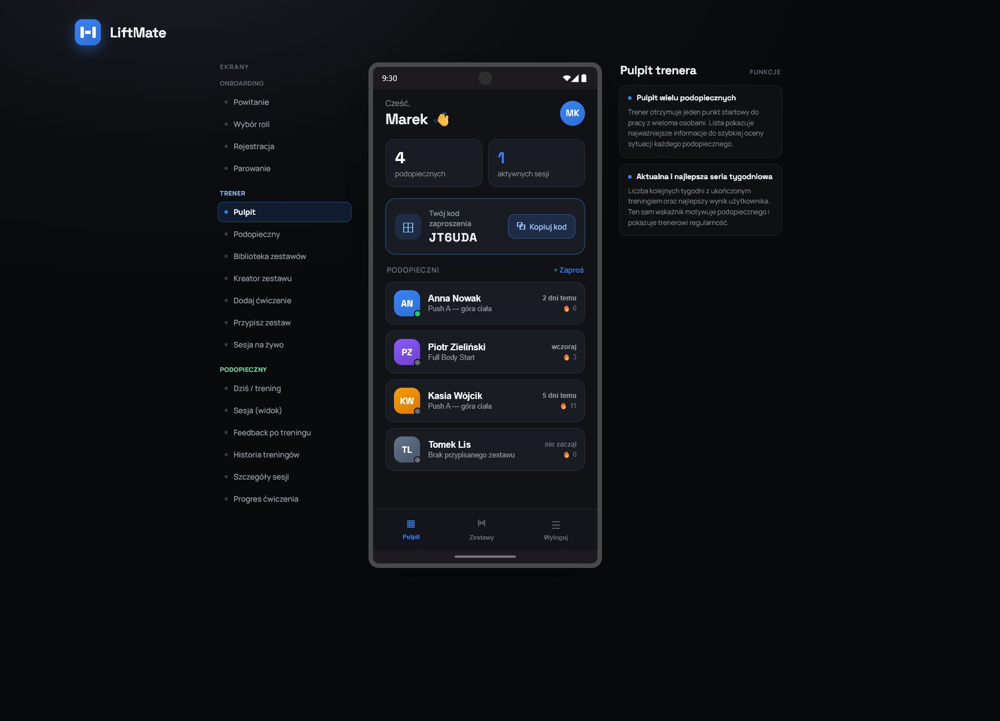
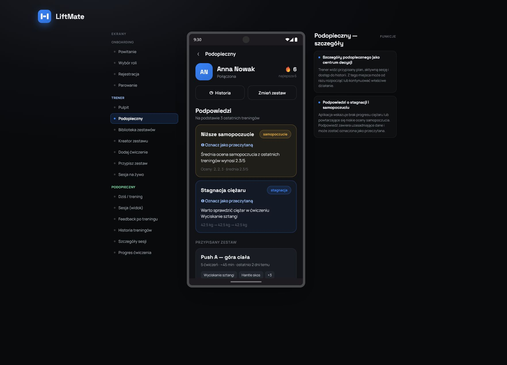
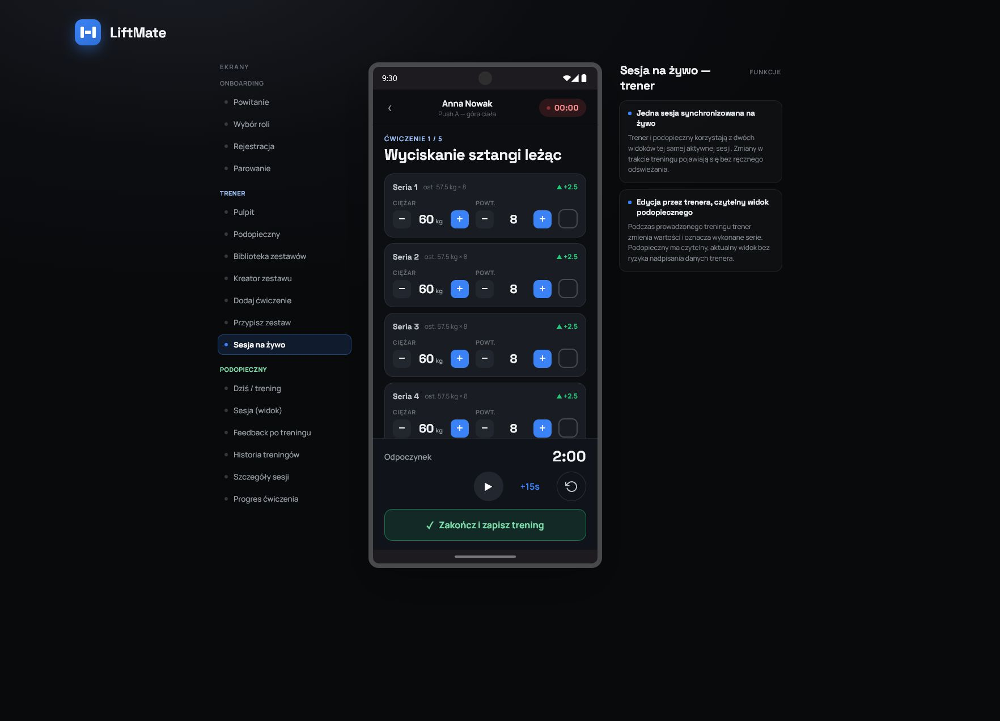
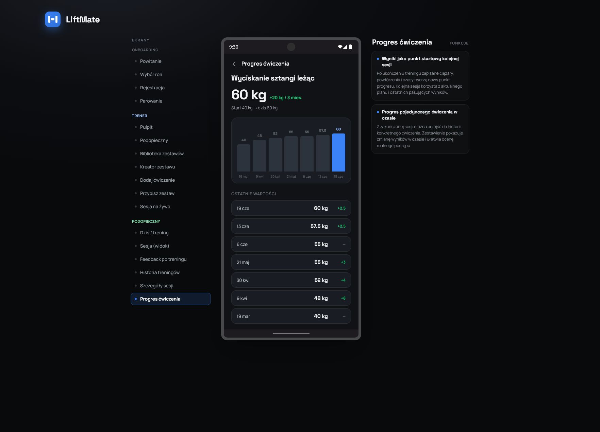
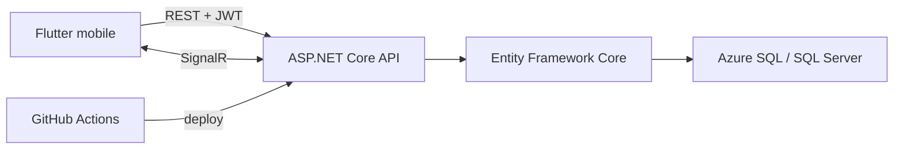

# LiftMate

**Mobilna aplikacja treningowa, która łączy trenera z podopiecznym. Wspiera cały proces, od przygotowania planu i wspólnej sesji na żywo po informację zwrotną oraz mierzalne postępy.**

[**Zobacz interaktywną prezentację**](https://jdemb.github.io/liftmate-demo) · [**Pobierz aplikację na Androida**](https://github.com/jdemb/PrototypApka/releases/download/v1.0.0/LiftMate-v1.0.0-android.apk)

> Prezentacja pozwala przejść przez wszystkie ekrany bez instalowania aplikacji. APK jest wersją demonstracyjną instalowaną ręcznie poza Google Play. Rejestracja w publicznym środowisku wymaga kodu beta.

<table>
  <tr>
    <td align="center"><a href="docs/assets/readme/trainer-dashboard.png"></a><br><strong>Pulpit trenera</strong></td>
    <td align="center"><a href="docs/assets/readme/trainer-guidance.png"></a><br><strong>Podopieczny i podpowiedzi</strong></td>
  </tr>
  <tr>
    <td align="center"><a href="docs/assets/readme/live-session.png"></a><br><strong>Sesja na żywo</strong></td>
    <td align="center"><a href="docs/assets/readme/exercise-progress.png"></a><br><strong>Postępy w ćwiczeniu</strong></td>
  </tr>
</table>

## O projekcie

LiftMate ułatwia podejmowanie decyzji podczas treningu. Trener przygotowuje i przypisuje plan, a podopieczny ćwiczy zgodnie z aktualnymi założeniami i zachowuje ciągłość postępów między kolejnymi sesjami.

Projekt ma strukturę monorepo i obejmuje aplikację mobilną stworzoną we Flutterze oraz interfejs API zbudowany w ASP.NET Core. Obsługuje cały proces, od rejestracji i połączenia kont po historię treningów, informacje zwrotne oraz analizę postępów.

## Dla kogo jest LiftMate?

- **Trener personalny** prowadzi wielu podopiecznych, zarządza planami, uruchamia wspólne sesje oraz analizuje historię i regularność treningów.
- **Podopieczny** wykonuje trening pod nadzorem trenera lub samodzielnie, przekazuje informacje zwrotne i obserwuje swoje postępy.

## Główne funkcje

- współpraca jednego trenera z wieloma podopiecznymi, nawiązywana za pomocą kodu zaproszenia;
- tworzenie, edycja, usuwanie i wielokrotne przypisywanie zestawów ćwiczeń;
- dane wspólnej sesji aktualizowane u trenera i podopiecznego bez ręcznego odświeżania;
- samodzielny trening podopiecznego z możliwością edycji własnych wyników;
- zapisywanie wykonanych serii jako punktu wyjścia do kolejnego treningu;
- historia sesji i postępy w poszczególnych ćwiczeniach;
- ocena samopoczucia oraz opcjonalny komentarz po treningu;
- aktualna oraz najlepsza seria kolejnych tygodni, w których ukończono trening;
- podpowiedzi dla trenera dotyczące braku postępów w zwiększaniu obciążenia oraz obniżonego samopoczucia podopiecznego.

Rozszerzony opis znajduje się w [prezentacji funkcji](apps/mobile/design/prezentacja-funkcji.md), a powiązania z kodem, API i testami w [mapie implementacji](apps/mobile/design/mapa-implementacji.md).

## Architektura



- **Flutter** odpowiada za interfejs trenera i podopiecznego, zarządzanie stanem aplikacji, bezpieczne przechowywanie tokenów oraz synchronizację danych na żywo.
- **ASP.NET Core** obsługuje uwierzytelnianie JWT, autoryzację ról i relacji, logikę treningową, REST API oraz komunikację przez SignalR.
- **Entity Framework Core i SQL Server** przechowują konta, relacje, plany, sesje, informacje zwrotne oraz dane o postępach. Schemat bazy danych jest rozwijany za pomocą migracji.
- **Azure App Service i Azure SQL** zapewniają środowisko demonstracyjne, natomiast GitHub Actions automatyzuje migracje oraz wdrażanie API.

## Struktura repozytorium

```text
apps/mobile/      aplikacja Flutter i testy mobilne
apps/api/         API ASP.NET Core, migracje i testy integracyjne
context/          PRD, roadmapa, infrastruktura i historia zmian
docs/assets/      zasoby dokumentacji
```

## Wymagania środowiskowe

- Flutter `3.44.0` i Dart `3.12.0` w wersjach użytych do końcowej weryfikacji;
- .NET SDK `10.0`, ponieważ projekty korzystają z platformy docelowej `net10.0`;
- JDK 17 i Android SDK;
- emulator Androida albo fizyczne urządzenie z tym systemem;
- SQL Server LocalDB na Windows albo dostępna instancja SQL Server;
- `dotnet-ef` `10.0.8` do wykonywania migracji lokalnej bazy.

## Konfiguracja

API odczytuje konfigurację ze standardowych źródeł ASP.NET Core. Dla lokalnego uruchomienia można ustawić zmienne w bieżącej sesji PowerShell z katalogu `apps/api`:

```powershell
$env:ConnectionStrings__DefaultConnection="Server=(localdb)\mssqllocaldb;Database=LiftMateDev;Trusted_Connection=True;TrustServerCertificate=True"
$env:Jwt__SigningKey="lokalny-klucz-o-dlugosci-co-najmniej-32-znakow"
$env:Auth__RegistrationInviteCode="lokalny-kod-beta"
```

Wartości powyżej są wyłącznie przykładami. Sekretów i produkcyjnego kodu beta nie należy commitować; środowisko Azure dostarcza je przez konfigurację App Service.

Aplikacja mobilna domyślnie pobiera adres API z [`apps/mobile/config/app_config.json`](apps/mobile/config/app_config.json). Jednorazowe nadpisanie jest możliwe przez `--dart-define=API_BASE_URL=...`.

## Uruchamianie API

W katalogu `apps/api`:

```powershell
dotnet restore LiftMate.slnx
dotnet tool install --global dotnet-ef --version 10.0.8
dotnet ef database update --project LiftMate.Api\LiftMate.Api.csproj --startup-project LiftMate.Api\LiftMate.Api.csproj
dotnet run --project LiftMate.Api\LiftMate.Api.csproj
```

Profil HTTP uruchamia lokalne API pod `http://localhost:5257`. Endpoint kontrolny jest dostępny pod `http://localhost:5257/health`.

## Uruchamianie aplikacji

W katalogu `apps/mobile`:

```powershell
flutter pub get
flutter devices
flutter run
```

Domyślna konfiguracja wskazuje publiczne środowisko demonstracyjne. Aby Android Emulator korzystał z API uruchomionego lokalnie na komputerze:

```powershell
flutter run --dart-define=API_BASE_URL=http://10.0.2.2:5257
```

`10.0.2.2` jest adresem hosta widzianym z oficjalnego Android Emulatora. Fizyczne urządzenie wymaga osiągalnego adresu komputera w tej samej sieci.

## Testy

Testy aplikacji mobilnej należy uruchomić z katalogu `apps/mobile`:

```powershell
flutter analyze
flutter test
```

Testy API należy uruchomić z katalogu `apps/api`:

```powershell
dotnet restore LiftMate.slnx
dotnet build LiftMate.slnx --no-restore
dotnet test LiftMate.slnx --no-build --verbosity minimal
dotnet list LiftMate.slnx package --vulnerable --include-transitive
```

Testy aplikacji mobilnej obejmują logikę, klientów HTTP, kontrolery i widgety. Testy API korzystają z xUnit, `WebApplicationFactory` oraz bazy SQLite działającej w pamięci. Pozwala to sprawdzić rzeczywistą obsługę żądań HTTP, autoryzację i trwałość danych bez zewnętrznej bazy testowej.

## Dokumentacja

- [PRD bazowego produktu](context/foundation/prd.md)
- [PRD rozszerzeń](context/foundation/prd-expansion.md)
- [Roadmapa](context/foundation/roadmap.md)
- [Decyzja infrastrukturalna](context/foundation/infrastructure.md)
- [Stos aplikacji mobilnej](context/foundation/tech-stack.md)
- [Stos API](context/foundation/tech-stack-api.md)
- [Prezentacja funkcji](apps/mobile/design/prezentacja-funkcji.md)
- [Mapa implementacji i testów](apps/mobile/design/mapa-implementacji.md)

## Obsługiwane platformy

- **Android:** główna platforma demonstracyjna; dostępny jest plik instalacyjny APK.
- **iOS:** kod platformowy jest obecny w projekcie Flutter, ale aplikacja nie była testowana na fizycznych urządzeniach z systemem iOS z powodu braku dostępu do wymaganego środowiska Apple.
