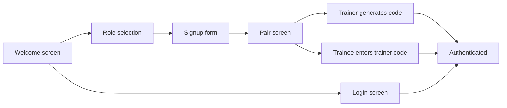

# Dostosowanie onboardingu auth do projektu Design

## Overview

Przebudować istniejący przepływ logowania i tworzenia konta w aplikacji mobilnej tak, żeby odpowiadał projektowi z `apps/mobile/design/LiftMate.dc.html`, rozszerzyć backend o imię i nazwisko użytkownika oraz dodać podstawowe parowanie trener-podopieczny kodem zaproszenia trenera. Zakres obejmuje pełny onboarding auth: powitanie, wybór roli, osobny login, rejestrację oraz ekran parowania po rejestracji, ale nie obejmuje docelowych dashboardów trenera i podopiecznego.

## Current State Analysis

Obecny Flutter auth UI jest skupiony w `apps/mobile/lib/auth/auth_screen.dart`: jeden ekran przełącza tryb `Sign in` / `Create account`, pokazuje role, kod zaproszenia, diagnostykę API oraz po zalogowaniu panele techniczne `RoleProbePanel` i `SharedSessionDiagnosticPanel`. `apps/mobile/lib/main.dart` uruchamia `AuthScreen` bez globalnego motywu dopasowanego do designu.

Design w `apps/mobile/design/LiftMate.dc.html` rozbija onboarding na kroki: `welcome`, `role`, `signup`, `pair`, a notatki designu wiążą je z FR-001, FR-002 i FR-003. Design używa ciemnego radialnego gradientu tła, niebieskiego koloru akcentu, logo LiftMate z gradientowym znakiem, fontów Space Grotesk / Manrope, polskich tekstów produktowych, kart wyboru roli `Jestem podopiecznym` / `Jestem trenerem`, dużych zaokrąglonych pól i niebieskich przycisków z poświatą.

Backend auth ma obecnie `RegisterRequest(Email, Password, Role, InvitationCode)` i `UserResponse(Id, Email, Role)` w `apps/api/LiftMate.Api/Auth/AuthContracts.cs`. `ApplicationUser` przechowuje `LiftMateRole`, ale nie przechowuje imienia i nazwiska ani przypisania podopiecznego do trenera. Istniejące shared-session używa `TrainerUserId` i `TraineeUserId` na sesji, ale nie ma osobnej trwałej relacji trener-podopieczny. `TokenService.ToUserResponse` zwraca tylko `id`, `email`, `role`. Istnieją testy API i mobilne testy klienta oraz ekranu auth, które trzeba zaktualizować razem z kontraktem.

## Desired End State

Użytkownik widzi produktowy onboarding możliwie najbliższy designowi: powitanie LiftMate z logo, gradientem tła i poświatą CTA, wybór roli w kartach, osobny ekran logowania oraz ekran rejestracji z imieniem i nazwiskiem, e-mailem i hasłem. Teksty produktowe są takie same jak w designie tam, gdzie design je definiuje, a techniczne komunikaty API mogą pozostać po angielsku.

Po udanym loginie albo rejestracji aplikacja nadal przechodzi do tymczasowego stanu zalogowanego, bez wdrażania dashboardów z designu. Diagnostyka API i panele probe/shared-session nie są częścią auth UI.

Backend zapisuje i zwraca `displayName` dla użytkownika, a mobilny klient wysyła je przy rejestracji i parsuje z odpowiedzi auth. Rejestracja nie pokazuje ani nie wymaga osobnego ekranu `Kod dostępu`, bo taki ekran nie istnieje w designie. Trener po uzupełnieniu danych konta przechodzi bezpośrednio na ekran `Zaproś podopiecznego`, gdzie automatycznie generuje się kod trenera do przekazania poza aplikacją. Podopieczny po uzupełnieniu danych konta przechodzi bezpośrednio na ekran `Połącz się z trenerem`, gdzie wpisuje kod otrzymany od trenera.

## Decisions

| Area | Decision | Rationale |
| --- | --- | --- |
| Scope | Full auth onboarding: welcome, role, login, signup, pair | This follows the Design flow while keeping dashboard work out of scope. |
| Language | Mixed UI | Product-facing onboarding text follows the Polish design; existing API error messages can stay technical/English. |
| Name field | Extend backend and mobile contract | The design contains name input and the user explicitly chose real persistence over visual-only input. |
| Registration gate | Remove global `invitationCode` from registration | The Design has no `Kod dostępu` screen; the only user-facing code in onboarding is the trainer invite code. |
| Trainer-trainee pairing | Add invite-code endpoints in this phase | This makes the Design pair screens functional without implementing a future trainer settings window. |
| Login | Separate login screen in the same style | The existing login remains functional while matching the multi-step onboarding structure. |
| Diagnostics | Remove from auth UI | Auth screens become product-facing instead of test panels. |
| Post-auth destination | Keep current authenticated panel temporarily | This avoids expanding into trainer/trainee dashboards in this change. |

## Scope

In scope:

- Add backend `displayName` support to auth registration, user persistence, auth responses, `/auth/me`, tests, and migrations.
- Add backend trainer invite-code generation and trainee code-claiming endpoints.
- Add persistent trainer-trainee relationship for assigning a trainee to exactly one trainer.
- Update mobile auth models, client, controller, and tests to send and parse `displayName`.
- Update mobile auth client/controller for invite-code generation and trainee pairing.
- Rework `AuthScreen` into a multi-step onboarding UI based on `welcome`, `role`, `login`, `signup`, and `pair`.
- Remove the global registration `invitationCode` gate from the auth onboarding and API registration contract.
- Remove API diagnostics and auth diagnostic panels from the auth screen surface.
- Preserve authenticated state and logout capability as a temporary post-auth screen.
- Update automated tests for backend auth, mobile auth client, and mobile auth widget behavior.

Out of scope:

- Trainer dashboard, trainee dashboard, workout screens, set builder, history, and live session UI from the design.
- Future trainer access to the invite-code screen outside onboarding.
- In-app delivery/sharing of trainer invite codes; sending the code happens outside the app.
- Invite-code lifecycle beyond MVP generation/claiming, such as expiration controls, revocation UI, or multi-code management.
- Trainer approval, admin verification, or any other gate deciding who is allowed to create a trainer account.
- Password reset, social login, e-mail verification, and account settings.
- Pixel-perfect reproduction of the design export; implementation should be as close as practical, but can adapt vertical spacing and scrolling where the HTML prototype height is imperfect.

## Architecture / Approach

The change is a contract-first vertical slice. Backend adds a first-class `DisplayName` property to `ApplicationUser`, exposes it in auth request/response contracts, persists trainer-trainee pairing data, and adds two pairing endpoints: one trainer-only endpoint to generate/read a trainer invite code, and one trainee-only endpoint to claim that code. Mobile updates its auth model and API client to match those contracts, then replaces the one-form auth UI with a small internal onboarding state machine. Diagnostics remain available through their standalone components/tests but are no longer composed into `AuthScreen`.

## Phase 1: Backend Auth Contract

### Goal

Persist and return the user's display name, trainer invite codes, and the trainee's trainer assignment so the mobile signup and pair screens map to real backend data.

### Changes Required

#### `apps/api/LiftMate.Api/Auth/ApplicationUser.cs`

**Intent:** Add a durable display name field to the Identity user entity.

**Contract:** `ApplicationUser` exposes `DisplayName` as a required string property. It also exposes nullable `TrainerUserId` / `TrainerUser` for trainee accounts; trainer accounts leave this null.

#### `apps/api/LiftMate.Api/Auth/TrainerInviteCode.cs` (new)

**Intent:** Persist the trainer code that is shared outside the app.

**Contract:** Entity stores `Code`, `TrainerUserId`, `TrainerUser`, `CreatedAt`, and optionally `LastUsedAt`; `Code` is unique and maps to exactly one trainer. Codes are normalized uppercase 6-character alphanumeric strings using unambiguous characters only: `ABCDEFGHJKLMNPQRSTUVWXYZ23456789`.

#### `apps/api/LiftMate.Api/Data/ApplicationDbContext.cs`

**Intent:** Configure display-name storage consistently with existing explicit user-role configuration.

**Contract:** `ApplicationUser.DisplayName` has a bounded max length and is required. `ApplicationUser.TrainerUserId` is nullable, indexed, and configured as a self-reference to `ApplicationUser`. `TrainerInviteCode` is mapped with a unique `Code` index and required trainer FK.

#### `apps/api/LiftMate.Api/Auth/AuthContracts.cs`

**Intent:** Extend auth DTOs to accept and return a display name.

**Contract:** `RegisterRequest` includes `DisplayName`; `UserResponse` includes `DisplayName` and nullable `TrainerUserId`. Add pairing DTOs: `TrainerInviteCodeResponse(Code)` and `ClaimTrainerInviteCodeRequest(Code)`.

#### `apps/api/LiftMate.Api/Auth/AuthEndpoints.cs`

**Intent:** Validate, trim, and store display name during registration.

**Contract:** Empty display names return `400`; successful registration stores the trimmed value.

#### `apps/api/LiftMate.Api/Auth/PairingEndpoints.cs` (new)

**Intent:** Make the Design pair screens functional without building a future trainer settings window.

**Contract:** Add:

- `POST /trainer/invite-code` requiring `TrainerOnly`, returning the trainer's existing code or generating a new unique 6-character uppercase code.
- `POST /trainee/trainer-link` requiring `TraineeOnly`, accepting `{ "code": "..." }`, trimming and uppercasing the input before lookup, assigning the current trainee to the trainer behind that code, and returning the updated user or a pairing response.

The trainee endpoint rejects non-trainee tokens, invalid codes, self-pairing, trainer accounts, and attempts to reassign an already linked trainee.

#### `apps/api/LiftMate.Api/SharedSessions/SharedSessionEndpoints.cs`

**Intent:** Make the new persistent trainer-trainee relationship authoritative for training session creation.

**Contract:** `Create` continues to resolve `traineeEmail`, but it only creates a session when `trainee.TrainerUserId == trainerUserId`. A trainer attempting to create a shared session for an unpaired trainee or another trainer's trainee receives a forbidden or bad-request response. Existing participant read/update rules remain based on the `SharedSession` participant IDs.

#### `apps/api/LiftMate.Api/Program.cs`

**Intent:** Register the new pairing routes.

**Contract:** App maps `PairingEndpoints` alongside existing auth/probe/shared-session endpoints.

#### `apps/api/LiftMate.Api/Auth/TokenService.cs`

**Intent:** Include display name in every auth response and `/auth/me` response.

**Contract:** `ToUserResponse` maps `ApplicationUser.DisplayName`.

#### `apps/api/LiftMate.Api/Migrations/*` and `ApplicationDbContextModelSnapshot.cs`

**Intent:** Add display-name, trainer relationship, and trainer invite-code storage.

**Contract:** Migration adds a non-null `DisplayName` column to `AspNetUsers`, nullable `TrainerUserId` FK/index on `AspNetUsers`, and a `TrainerInviteCodes` table with unique `Code`. Existing users receive a safe display-name default and remain unpaired.

#### `apps/api/LiftMate.Api.Tests/Auth/AuthEndpointTests.cs`

**Intent:** Lock the new register/me response contract and validation behavior.

**Contract:** Test helper records include `DisplayName`; assertions verify registration and `/auth/me` return it; invalid blank name is rejected.

#### `apps/api/LiftMate.Api.Tests/Auth/PairingEndpointTests.cs` (new)

**Intent:** Lock trainer-code generation and trainee assignment behavior.

**Contract:** Tests cover trainer can generate a normalized 6-character code, code generation is idempotent for a trainer, trainee can claim it with lowercase/whitespace input, trainee `/auth/me` shows the trainer assignment, invalid code returns `400` or `404`, and already-linked trainee cannot be reassigned.

#### `apps/api/LiftMate.Api.Tests/SharedSessions/SharedSessionEndpointTests.cs`

**Intent:** Prevent the new relationship model from being bypassed by existing shared-session endpoints.

**Contract:** Shared-session creation tests pair the trainer and trainee before creating sessions. Add a regression test proving a different trainer cannot create a session for a trainee already linked to another trainer.

### Success Criteria

#### Automated Verification

- `dotnet restore LiftMate.slnx` succeeds from `apps/api`.
- `dotnet build LiftMate.slnx --no-restore` succeeds from `apps/api`.
- `dotnet test LiftMate.slnx --no-build` succeeds from `apps/api`.

#### Manual Verification

- A test registration through the API returns `user.displayName` in the auth response.
- `/auth/me` returns the same `displayName` and the trainee's `trainerUserId` when linked.
- A trainer can generate an invite code and a trainee can claim it with a separate authenticated request.
- A trainer cannot create a shared session for an unpaired trainee or another trainer's paired trainee.

---

## Phase 2: Mobile Auth Contract

### Goal

Update the Flutter auth layer so it sends, receives, stores in memory, and tests display names and pairing calls without changing token storage.

### Changes Required

#### `apps/mobile/lib/auth/auth_models.dart`

**Intent:** Represent the backend's display name in mobile auth state.

**Contract:** `AuthUser` includes `displayName` and nullable `trainerUserId`; `AuthUser.fromJson` requires a string `displayName`.

#### `apps/mobile/lib/auth/auth_api_client.dart`

**Intent:** Send display name during registration.

**Contract:** `register` accepts `displayName` and posts only `email`, `password`, `role`, and `displayName`. Add `generateTrainerInviteCode(accessToken)` and `claimTrainerInviteCode(accessToken, code)` methods matching backend endpoints. Mobile trims and uppercases trainer-code input before submission, matching backend normalization.

#### `apps/mobile/lib/auth/auth_controller.dart`

**Intent:** Thread display name from UI to API.

**Contract:** `AuthController.register` accepts required `displayName`. Add controller methods to generate a trainer invite code and claim a trainer invite code using the current access token, updating the authenticated user state after a successful trainee claim.

#### `apps/mobile/test/auth_api_client_test.dart`

**Intent:** Keep the mobile API contract in sync with backend DTOs.

**Contract:** Register request expectations include `displayName`, auth response fixtures include `displayName` and nullable `trainerUserId`, and new tests cover trainer-code generation plus trainee code claim with lowercase/whitespace input normalization.

#### Related mobile tests

**Intent:** Prevent fixture breakage after `AuthUser` becomes stricter.

**Contract:** Every mobile auth response fixture includes `displayName`.

### Success Criteria

#### Automated Verification

- `flutter test test/auth_api_client_test.dart` succeeds from `apps/mobile`.
- `flutter test` succeeds from `apps/mobile`.
- `flutter analyze` succeeds from `apps/mobile`.

#### Manual Verification

- Mobile registration sends `displayName` to `/auth/register`.
- Existing login still works with responses that include `displayName`.
- Mobile pairing methods call `/trainer/invite-code` and `/trainee/trainer-link` with bearer tokens.
- Mobile trainee code entry trims whitespace and normalizes to uppercase before submitting.

---

## Phase 3: Mobile Onboarding UI

### Goal

Replace the current technical auth screen with a product-facing onboarding flow based on the Design prototype.

### Changes Required

#### `apps/mobile/lib/main.dart`

**Intent:** Apply a dark, LiftMate-specific app theme compatible with the Design visual system.

**Contract:** `MaterialApp` uses a dark theme with blue primary color and typography choices that degrade cleanly if custom fonts are not bundled.

#### `apps/mobile/lib/auth/auth_screen.dart`

**Intent:** Rebuild the unauthenticated UI into a multi-step onboarding flow.

**Contract:** The unauthenticated states include:

- Welcome screen with LiftMate branding and actions: `Załóż konto`, `Mam już konto`.
- Role selection screen with trainer and trainee choices.
- Separate login form with e-mail and password.
- Signup form with display name, e-mail, password, and role context.
- Pair screen after registration flow that reflects the selected role:
  - trainer variant calls trainer invite-code generation and displays the code to share outside the app;
  - trainee variant accepts a trainer code, calls the trainee claim endpoint, and only then continues to the temporary authenticated panel.

#### `apps/mobile/lib/auth/auth_screen.dart`

**Intent:** Remove technical diagnostics from the auth surface.

**Contract:** `AuthScreen` no longer renders `_HealthDiagnostics`, `RoleProbePanel`, or `SharedSessionDiagnosticPanel`; authenticated state keeps a minimal temporary user panel and logout action.

#### `apps/mobile/lib/auth/auth_screen.dart`, `apps/mobile/lib/main.dart`, and `apps/mobile/test/auth_screen_test.dart`

**Intent:** Remove dead diagnostic wiring after diagnostics leave the auth surface.

**Contract:** `AuthScreen` constructor no longer accepts `authApiClient`, `sharedSessionApiClient`, `sharedSessionRealtimeClientFactory`, `healthUri`, or `checkHealth` unless still needed by the temporary authenticated panel. `main.dart` and the auth widget-test `_testApp` helper pass only the dependencies still required by auth, pairing, and logout. Standalone diagnostic components and their dedicated tests remain untouched.

#### `apps/mobile/test/auth_screen_test.dart`

**Intent:** Verify the new flow as a user-visible onboarding experience.

**Contract:** Widget tests cover welcome screen, role selection, login submission, signup submission with display name, trainer code display, trainee code claim, pairing error display without secret leakage, and logout returning to onboarding.

### Success Criteria

#### Automated Verification

- `flutter test test/auth_screen_test.dart` succeeds from `apps/mobile`.
- `flutter test` succeeds from `apps/mobile`.
- `flutter analyze` succeeds from `apps/mobile`.

#### Manual Verification

- On a phone-sized viewport, onboarding text and controls do not overlap.
- `Załóż konto` reaches role selection and signup.
- `Mam już konto` reaches login.
- Signup for trainer and trainee roles preserves the selected role.
- Trainer signup reaches pair screen and displays a generated trainer invite code.
- Trainee signup reaches pair screen and can claim a trainer invite code before continuing.
- Auth errors remain visible without exposing password or invitation code.
- Technical diagnostics are absent from the auth UI.
- `AuthScreen` no longer exposes constructor parameters used only by the removed diagnostics.

---

## Phase 4: Design Fidelity and Code Separation Fix

### Goal

Tighten the implemented onboarding UI so it follows `apps/mobile/design/LiftMate.dc.html` as closely as practical, while fixing the incorrect placement of registration and trainer invite codes.

Phase 4 is a historical design-fidelity phase already partially completed in commit `7b97602`. It moved the UI toward the design and separated code concepts visually, but it did not fully remove the old global registration `invitationCode` contract. Phase 5 supersedes that old assumption and owns the backend/mobile contract change.

### Changes Required

#### `apps/mobile/pubspec.yaml` and font assets under `apps/mobile/assets/fonts/`

**Intent:** Match the typography in the design instead of relying on Flutter's default font.

**Contract:** Bundle and register the same font families used by the design export: `Space Grotesk` for logo/headlines/code displays and `Manrope` for body text, labels, fields, and buttons. If font files are not already in the repo, add the required `.ttf` assets under a dedicated mobile assets folder and declare them in `pubspec.yaml`. Do not leave `Roboto` as the primary app font for this onboarding surface.

#### `apps/mobile/lib/main.dart`

**Intent:** Make the global auth theme align with the design system.

**Contract:** The theme uses the design colors and component proportions as the baseline: dark background around `#101216`, radial blue glow using `#3a82f6`, muted text around `#969ba3`, fields around `#191c22`, borders using low-opacity white, button radius around 15-16 px, field radius around 14 px, and primary button glow comparable to `box-shadow: 0 10px 26px rgba(58,130,246,.4)`. Material defaults are acceptable only where they do not visibly fight the design.

#### `apps/mobile/lib/auth/auth_screen.dart`

**Intent:** Replace the Material-looking approximation with a close Flutter adaptation of the design auth screens.

**Contract:** The auth screens match the design structure, visual hierarchy, and visible copy as closely as practical:

- Welcome screen uses the design logo mark, `LiftMate` wordmark, headline `Trenuj bez myślenia o liczbach.`, body copy from the design, radial gradient/glow background, `Załóż konto` primary button with blue glow, and `Mam już konto` outlined secondary button.
- Role screen uses title `Jak korzystasz z LiftMate?`, subtitle `Wybierz rolę. Zmienisz ją w ustawieniach.`, role cards labelled `Jestem podopiecznym` and `Jestem trenerem`, matching icon/emoji treatment, selected-state border/background, and `Dalej`.
- Signup screen uses the design copy `Załóż konto`, role subtitle, and fields `Imię i nazwisko`, `E-mail`, `Hasło`; it does not show any global registration invitation code inline beside personal data.
- Trainee registration keeps the trainer invite code out of the signup form; after account creation, the trainee enters only the trainer invite code on the design's `Połącz się z trenerem` pairing screen. Removing the backend/mobile global `invitationCode` contract is handled by Phase 5.
- Trainer registration must not display the global registration code next to personal data, and must never ask for or show a trainee/trainer pairing code before account creation succeeds.
- After trainer signup, show the design `Zaproś podopiecznego` screen with `Twój kod zaproszenia`, large spaced code, `Kopiuj kod`, and `Przejdź do pulpitu`.
- After trainee signup, show the design `Połącz się z trenerem` screen with separated code boxes and `Połącz konto`; this is the trainer invite code, not the global registration code.
- Back arrows, spacing, card shapes, text sizes, field fills, and button states should be adapted from the HTML values rather than default Material components where practical.

#### `apps/mobile/lib/auth/auth_screen.dart`

**Intent:** Make the two code concepts impossible to confuse.

**Contract:** The implementation has separate state, controllers, labels, and tests for:

- trainer invite code: generated by `/trainer/invite-code` and claimed through `/trainee/trainer-link`.

The implementation should not contain a global registration-code field beside personal signup data. The trainer role should generate and show the trainer invite code only on the post-registration `Zaproś podopiecznego` screen. The trainee role should not enter the trainer invite code until the post-registration `Połącz się z trenerem` screen. Full removal of the global registration-code step and request payload is Phase 5 scope.

#### `apps/mobile/test/auth_screen_test.dart`

**Intent:** Lock the corrected flow and visible design copy.

**Contract:** Widget tests verify the design-specific visible copy and separation rules:

- welcome screen renders `Trenuj bez myślenia o liczbach.`, `Załóż konto`, and `Mam już konto`;
- role screen renders `Jestem podopiecznym`, `Jestem trenerem`, and `Jak korzystasz z LiftMate?`;
- trainer signup screen renders personal fields but does not render `Kod trenera`, `Twój kod zaproszenia`, or an inline registration-code field beside personal data;
- trainee signup screen renders personal fields and does not render `Kod trenera` before registration succeeds;
- trainer post-signup screen renders `Zaproś podopiecznego`, `Twój kod zaproszenia`, generated code, `Kopiuj kod`, and `Przejdź do pulpitu`;
- trainee post-signup screen renders `Połącz się z trenerem`, code boxes/input, and `Połącz konto`;
- tests make clear the trainer invite code is separate from signup personal data. Phase 5 updates register requests so they no longer include a global `invitationCode`.

### Success Criteria

#### Automated Verification

- `flutter test test/auth_screen_test.dart` succeeds from `apps/mobile`.
- `flutter test` succeeds from `apps/mobile`.
- `flutter analyze` succeeds from `apps/mobile`.

#### Manual Verification

- On a phone-sized viewport, auth onboarding is visibly close to the design: radial gradient background, logo mark, Space Grotesk/Manrope typography, blue CTA glow, card-style role selection, dark filled inputs, and matching button shapes.
- The welcome, role, signup, trainee pair, and trainer invite screens use the same primary user-facing copy as the design.
- Trainer signup does not show the global registration code next to personal fields.
- Trainee signup does not ask for a trainer invite code until the separate `Połącz się z trenerem` screen.
- Trainer invite code display matches the design's separate `Zaproś podopiecznego` screen.
- The implementation remains scrollable and readable on small phones even where the HTML prototype has imperfect screen height.

---

## Phase 5: Auth Flow Correction to Match Design

### Goal

Remove the non-design `Kod dostępu` registration gate and make the signup-to-pair flow match `apps/mobile/design/LiftMate.dc.html`: trainer signup immediately opens `Zaproś podopiecznego` with a generated trainer code, and trainee signup immediately opens `Połącz się z trenerem` to enter that trainer code.

### Changes Required

#### `apps/api/LiftMate.Api/Auth/AuthContracts.cs`

**Intent:** Make the backend registration contract match the design signup form.

**Contract:** `RegisterRequest` contains only `Email`, `Password`, `Role`, and `DisplayName`. It no longer contains `InvitationCode`.

#### `apps/api/LiftMate.Api/Auth/AuthEndpoints.cs`, `Program.cs`, `appsettings.json`

**Intent:** Remove the old global registration gate that created the non-design `Kod dostępu` screen.

**Contract:** `/auth/register` no longer depends on `RegistrationGate`, no longer reads `Auth:RegistrationInviteCode`, and no longer rejects registration because of a missing or invalid global invite code. Existing role, duplicate-email, display-name, and password validations remain.

This intentionally makes trainer signup open for this phase. Do not reintroduce a hidden trainer approval code or an alternate global invite gate to compensate; future trainer verification/approval belongs to a separate change.

#### `apps/api/LiftMate.Api/Auth/RegistrationGate.cs`

**Intent:** Delete dead gate code after the registration contract stops using it.

**Contract:** Remove the class and all service/config references to it. Do not replace it with another user-facing registration code.

#### `apps/api/LiftMate.Api.Tests/Auth/AuthEndpointTests.cs` and `TestApplicationFactory.cs`

**Intent:** Lock the corrected backend contract.

**Contract:** Auth endpoint tests post register payloads without `InvitationCode`, remove the invalid global invite-code rejection test, and keep coverage for invalid role, blank display name, duplicate email, login, `/auth/me`, refresh, and logout.

#### `apps/mobile/lib/auth/auth_api_client.dart`

**Intent:** Make mobile registration submit the same fields as the design signup form.

**Contract:** `register` no longer accepts or sends `invitationCode`. Request body contains only `email`, `password`, `role`, and `displayName`.

#### `apps/mobile/lib/auth/auth_controller.dart`

**Intent:** Remove global registration-code state from the controller API.

**Contract:** `AuthController.register` no longer accepts `invitationCode`; trainer invite-code generation and trainee trainer-link claiming remain separate authenticated calls after successful registration.

#### `apps/mobile/lib/auth/auth_screen.dart`

**Intent:** Make the visible flow match the design, not an invented auth gate.

**Contract:** Remove `_AuthStep.registrationCode`, `_registrationCodeFormKey`, `_invitationCodeController`, `_RegistrationCodeForm`, and all `Kod dostępu` / `Kod rejestracji` copy. `Utwórz konto` on the signup screen calls registration directly. After successful trainer registration, the screen switches to `Zaproś podopiecznego` and automatically calls `/trainer/invite-code`; after successful trainee registration, the screen switches to `Połącz się z trenerem`.

#### `apps/mobile/lib/auth/auth_screen.dart`

**Intent:** Correct first-screen visual drift reported during device/design review.

**Contract:** Welcome screen uses the design logo mark structure from `LiftMate.dc.html` (left vertical bar, center horizontal bar, right vertical bar), displays the wordmark beside the icon, removes the extra body copy `Trener ustawia plan...`, and uses the design primary button color `#3a82f6` with the same glow direction/intensity as the prototype.

#### `apps/mobile/test/auth_api_client_test.dart`

**Intent:** Lock the mobile registration payload against reintroducing the global code.

**Contract:** Register tests expect no `invitationCode` key. Secret-leakage tests use password/error-only assertions and no longer mention a registration invite secret.

#### `apps/mobile/test/auth_screen_test.dart`

**Intent:** Lock the corrected design flow end to end.

**Contract:** Widget tests assert:

- welcome screen has no extra body copy below the headline;
- `Kod dostępu` and `Kod rejestracji` never render in auth onboarding;
- trainer signup sends registration immediately and then renders `Zaproś podopiecznego`, `Twój kod zaproszenia`, generated code, `Kopiuj kod`, and `Przejdź do pulpitu`;
- trainee signup sends registration immediately and then renders `Połącz się z trenerem`, code boxes/input, and `Połącz konto`;
- register requests contain `email`, `password`, `role`, and `displayName`, with no global invite-code field.

### Success Criteria

#### Automated Verification

- `dotnet build LiftMate.slnx --no-restore` succeeds from `apps/api`.
- `dotnet test LiftMate.slnx --no-build` succeeds from `apps/api`.
- `flutter test test/auth_api_client_test.dart` succeeds from `apps/mobile`.
- `flutter test test/auth_screen_test.dart` succeeds from `apps/mobile`.
- `flutter test` succeeds from `apps/mobile`.
- `flutter analyze` succeeds from `apps/mobile`.

#### Manual Verification

- Welcome screen icon, wordmark placement, headline, button color, and absence of extra body copy match `LiftMate.dc.html`.
- There is no `Kod dostępu` or `Kod rejestracji` screen anywhere in auth onboarding.
- Trainer signup with name, e-mail, and password opens `Zaproś podopiecznego` and displays the generated trainer invite code.
- Trainee signup with name, e-mail, and password opens `Połącz się z trenerem` and accepts the trainer invite code.
- The only code a user sees during onboarding is the trainer invite code used to connect trainee to trainer.

---

## Testing Strategy

### Unit / Contract Tests

- Backend auth endpoint tests for register/login/me with `displayName`.
- Backend pairing endpoint tests for trainer code generation and trainee code claiming.
- Backend shared-session tests for enforcing trainer-trainee pairing before session creation.
- Mobile `AuthApiClient` tests for register payload without global invitation code and auth response parsing.
- Mobile `AuthApiClient` tests for pairing endpoint payloads and responses.
- Mobile model fixture updates anywhere `AuthUser` or auth JSON is constructed.

### Widget Tests

- Welcome screen renders initial actions.
- Role selection changes selected role before signup.
- Login submits credentials through `AuthController`.
- Signup submits display name, e-mail, password, and role without any global invitation code.
- Trainer pair screen requests and displays a trainer invite code.
- Trainee pair screen submits a trainer invite code and updates the authenticated user.
- Error state renders API message and does not leak password or trainer-code secrets.
- Authenticated temporary panel still allows logout.
- Auth widget-test setup no longer constructs diagnostic-only API clients or health-check callbacks.
- Design fidelity tests cover visible copy, role-card labels, absence of `Kod dostępu`, and post-signup invite/pair screens.

### Manual Testing Steps

1. Launch the mobile app and verify the welcome screen matches the dark LiftMate style.
2. Verify the welcome screen uses the design logo mark, gradient/glow background, headline, typography, CTA glow, and secondary outlined button.
3. Tap `Mam już konto`, submit login, and confirm authenticated state appears.
4. Logout, tap `Załóż konto`, select each role card, and verify signup role context.
5. Register a trainer with name, e-mail, and password, then confirm the pair screen displays a generated trainer invite code.
6. Register a trainee with name, e-mail, and password, enter the trainer invite code with mixed case or surrounding whitespace, and confirm `/auth/me` shows the trainee assigned to that trainer.
7. Confirm a different trainer cannot start a shared session for that paired trainee.
8. Trigger invalid trainer invite codes and confirm errors are readable and secrets are not shown.
9. Confirm no global registration invitation code appears anywhere in onboarding.

## Performance Considerations

This change is UI and auth-contract focused. No high-volume data path is introduced. Trainer invite-code generation should use a short indexed code lookup and retry on rare uniqueness collisions. Use the fixed character set `ABCDEFGHJKLMNPQRSTUVWXYZ23456789`, store codes uppercase, and normalize trainee input before lookup. Keep onboarding state local to `AuthScreen` to avoid unnecessary app-wide state management. Avoid expensive layout work or external runtime dependencies for the design export. Font assets are acceptable because they are static app assets; avoid runtime font downloads.

## Migration Notes

The backend migration must add `DisplayName` and nullable `TrainerUserId` to `AspNetUsers`, plus `TrainerInviteCodes`. Existing rows need a safe display-name default, preferably derived from `Email` where possible or a neutral fallback, so the non-null constraint applies cleanly. Existing users remain unpaired. The migration should be generated from the EF model rather than hand-edited unless the generated default or FK/index shape needs adjustment.

## Rollback Notes

Rolling back after deployment requires compatibility awareness: once mobile expects `displayName`, no registration `invitationCode`, and pairing endpoints, backend responses without them will fail strict parsing or pairing calls. If a staged rollout is needed, first deploy backend support, then mobile. Do not deploy the mobile contract change before backend support.

Removing the registration gate also changes access control posture: trainer account creation becomes open in this phase. If that is later rejected as a product/security decision, roll forward with a dedicated trainer verification or approval flow rather than restoring the non-design `Kod dostępu` gate.

## References

- Design prototype: `apps/mobile/design/LiftMate.dc.html`
- Current auth UI: `apps/mobile/lib/auth/auth_screen.dart`
- Mobile app entry point: `apps/mobile/lib/main.dart`
- Mobile auth client: `apps/mobile/lib/auth/auth_api_client.dart`
- Backend auth contracts: `apps/api/LiftMate.Api/Auth/AuthContracts.cs`
- Backend auth endpoint: `apps/api/LiftMate.Api/Auth/AuthEndpoints.cs`
- User entity config: `apps/api/LiftMate.Api/Data/ApplicationDbContext.cs`
- Shared session participant model: `apps/api/LiftMate.Api/SharedSessions/SharedSession.cs`
- Shared session endpoints: `apps/api/LiftMate.Api/SharedSessions/SharedSessionEndpoints.cs`
- Backend auth tests: `apps/api/LiftMate.Api.Tests/Auth/AuthEndpointTests.cs`
- Backend shared-session tests: `apps/api/LiftMate.Api.Tests/SharedSessions/SharedSessionEndpointTests.cs`
- Mobile auth tests: `apps/mobile/test/auth_screen_test.dart`

## Progress

> Convention: `- [ ]` pending, `- [x]` done. Append ` — <commit sha>` when a step lands. Do not rename step titles. See `references/progress-format.md`.

### Phase 1: Backend Auth Contract

#### Automated

- [x] 1.1 `dotnet restore LiftMate.slnx` succeeds from `apps/api` - 0400412.
- [x] 1.2 `dotnet build LiftMate.slnx --no-restore` succeeds from `apps/api` - 0400412.
- [x] 1.3 `dotnet test LiftMate.slnx --no-build` succeeds from `apps/api` - 0400412.

#### Manual

- [x] 1.4 A test registration through the API returns `user.displayName` in the auth response - 0400412.
- [x] 1.5 `/auth/me` returns the same `displayName` and the trainee's `trainerUserId` when linked - 0400412.
- [x] 1.6 A trainer can generate an invite code and a trainee can claim it with a separate authenticated request - 0400412.
- [x] 1.7 A trainer cannot create a shared session for an unpaired trainee or another trainer's paired trainee - 0400412.

### Phase 2: Mobile Auth Contract

#### Automated

- [x] 2.1 `flutter test test/auth_api_client_test.dart` succeeds from `apps/mobile` - 47473ef.
- [x] 2.2 `flutter test` succeeds from `apps/mobile` - 47473ef.
- [x] 2.3 `flutter analyze` succeeds from `apps/mobile` - 47473ef.

#### Manual

- [x] 2.4 Mobile registration sends `displayName` to `/auth/register` - 47473ef.
- [x] 2.5 Existing login still works with responses that include `displayName` - 47473ef.
- [x] 2.6 Mobile pairing methods call `/trainer/invite-code` and `/trainee/trainer-link` with bearer tokens - 47473ef.
- [x] 2.7 Mobile trainee code entry trims whitespace and normalizes to uppercase before submitting - 47473ef.

### Phase 3: Mobile Onboarding UI

#### Automated

- [x] 3.1 `flutter test test/auth_screen_test.dart` succeeds from `apps/mobile` - 0094a47.
- [x] 3.2 `flutter test` succeeds from `apps/mobile` - 0094a47.
- [x] 3.3 `flutter analyze` succeeds from `apps/mobile` - 0094a47.

#### Manual

- [x] 3.4 On a phone-sized viewport, onboarding text and controls do not overlap - 0094a47.
- [x] 3.5 `Załóż konto` reaches role selection and signup - 0094a47.
- [x] 3.6 `Mam już konto` reaches login - 0094a47.
- [x] 3.7 Signup for trainer and trainee roles preserves the selected role - 0094a47.
- [x] 3.8 Trainer signup reaches pair screen and displays a generated trainer invite code - 0094a47.
- [x] 3.9 Trainee signup reaches pair screen and can claim a trainer invite code before continuing - 0094a47.
- [x] 3.10 Auth errors remain visible without exposing password or invitation code - 0094a47.
- [x] 3.11 Technical diagnostics are absent from the auth UI - 0094a47.
- [x] 3.12 `AuthScreen` no longer exposes constructor parameters used only by the removed diagnostics - 0094a47.

### Phase 4: Design Fidelity and Code Separation Fix

#### Automated

- [x] 4.1 `flutter test test/auth_screen_test.dart` succeeds from `apps/mobile` - 7b97602.
- [x] 4.2 `flutter test` succeeds from `apps/mobile` - 7b97602.
- [x] 4.3 `flutter analyze` succeeds from `apps/mobile` - 7b97602.

#### Manual

- [ ] 4.4 On a phone-sized viewport, auth onboarding is visibly close to the design: radial gradient background, logo mark, Space Grotesk/Manrope typography, blue CTA glow, card-style role selection, dark filled inputs, and matching button shapes.
- [ ] 4.5 The welcome, role, signup, trainee pair, and trainer invite screens use the same primary user-facing copy as the design.
- [ ] 4.6 Trainer signup does not show the global registration code next to personal fields.
- [ ] 4.7 Trainee signup does not ask for a trainer invite code until the separate `Połącz się z trenerem` screen.
- [ ] 4.8 Trainer invite code display matches the design's separate `Zaproś podopiecznego` screen.
- [ ] 4.9 The implementation remains scrollable and readable on small phones even where the HTML prototype has imperfect screen height.

### Phase 5: Auth Flow Correction to Match Design

#### Automated

- [x] 5.1 `dotnet build LiftMate.slnx --no-restore` succeeds from `apps/api`.
- [x] 5.2 `dotnet test LiftMate.slnx --no-build` succeeds from `apps/api`.
- [x] 5.3 `flutter test test/auth_api_client_test.dart` succeeds from `apps/mobile`.
- [x] 5.4 `flutter test test/auth_screen_test.dart` succeeds from `apps/mobile`.
- [x] 5.5 `flutter test` succeeds from `apps/mobile`.
- [x] 5.6 `flutter analyze` succeeds from `apps/mobile`.

#### Manual

- [ ] 5.7 Welcome screen icon, wordmark placement, headline, button color, and absence of extra body copy match `LiftMate.dc.html`.
- [ ] 5.8 There is no `Kod dostępu` or `Kod rejestracji` screen anywhere in auth onboarding.
- [ ] 5.9 Trainer signup with name, e-mail, and password opens `Zaproś podopiecznego` and displays the generated trainer invite code.
- [ ] 5.10 Trainee signup with name, e-mail, and password opens `Połącz się z trenerem` and accepts the trainer invite code.
- [ ] 5.11 The only code a user sees during onboarding is the trainer invite code used to connect trainee to trainer.
