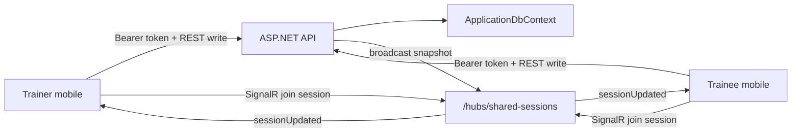

# Shared-session Sync Contract Implementation Plan

## Overview

Build LiftMate's minimal shared active-session sync contract. The API will persist a small active workout session snapshot, authorize access to the two explicit participants, accept writes from both trainer and trainee, and broadcast session updates through SignalR so both mobile clients can see the same session state without manual refresh.

This is foundation slice F-03 from `context/foundation/roadmap.md`. It exists to retire the highest-risk part of FR-012 before the full trainer-led workout slice S-04: two authenticated users must be able to observe the same active session object rather than drifting into separate local copies.

## Current State Analysis

### API

- `apps/api/LiftMate.Api/Program.cs:18` wires `ApplicationDbContext` with SQL Server.
- `apps/api/LiftMate.Api/Program.cs:59` defines trainer and trainee role policies.
- `apps/api/LiftMate.Api/Program.cs:74` keeps public `GET /health` as the smoke contract.
- `apps/api/LiftMate.Api/Program.cs:77` maps the auth endpoint group.
- `apps/api/LiftMate.Api/Program.cs:78` maps temporary role probe endpoints.
- `apps/api/LiftMate.Api/Data/ApplicationDbContext.cs:8` currently derives from Identity user context.
- `apps/api/LiftMate.Api/Data/ApplicationDbContext.cs:10` only exposes refresh-token domain storage beyond Identity.
- `apps/api/LiftMate.Api/Auth/AuthContracts.cs` defines the current DTO style as simple records with stable JSON fields.
- `apps/api/LiftMate.Api.Tests/TestApplicationFactory.cs` already provides an isolated SQLite-backed API test host.
- `apps/api/LiftMate.Api.Tests/Auth/AuthEndpointTests.cs:11` proves the register/login/me/refresh/logout contract.

### Mobile

- `apps/mobile/lib/main.dart` starts the app with `AuthScreen`, `AuthApiClient`, and `AuthController`.
- `apps/mobile/lib/auth/auth_api_client.dart:34` is the current typed HTTP client pattern.
- `apps/mobile/lib/auth/auth_api_client.dart:156` centralizes JSON request/response handling, bearer auth, timeouts, and error mapping.
- `apps/mobile/lib/auth/auth_models.dart` keeps API wire strings behind typed Dart models.
- Mobile tests already cover auth client, controller/storage behavior, and auth screen states under `apps/mobile/test/`.

### Product and Roadmap Constraints

- `context/foundation/prd.md` defines the trainer-led shared workout as must-have via FR-012 and US-03.
- `context/foundation/prd.md` expects workout changes to be visible without manual refresh in typical conditions.
- `context/foundation/roadmap.md` sets F-03 as a foundation before S-04, not the final workout UI.
- `context/foundation/roadmap.md` calls out free-tier realtime behavior as an unknown, but not a blocker.
- F-02 is present in code, but `context/changes/authenticated-role-boundary/plan.md` is locally modified and outside this change.

## Desired End State

The API has a minimal shared-session domain model and SignalR hub:

- A trainer can create a shared session for a real trainee user by ID with a small inline exercise-value snapshot.
- The trainer and the named trainee can retrieve, join, and update that session.
- Other users are denied, even if they are authenticated.
- Both trainer and trainee can write exercise values.
- Conflicts use last-write-wins: the API accepts the latest completed write and broadcasts the resulting full snapshot.
- Session status supports `active`, `completed`, and `cancelled`; non-active sessions reject further value updates.
- Every accepted mutation advances a server-owned session version and emits a SignalR update to the session group.

The Flutter app has a typed shared-session client and a lightweight authenticated diagnostic surface:

- A logged-in trainer can create a demo shared session for a trainee user ID.
- Either participant can join a session by ID, see the current snapshot, and receive SignalR updates.
- Either participant can submit a small value update and see the broadcast result.
- This UI is explicitly temporary diagnostic/product-risk validation, not the final workout screen.

## Key Decisions

| Decision | Choice | Rationale |
|---|---|---|
| Sync transport | SignalR | The user selected SignalR because the current free tier is acceptable for early MVP validation. |
| Latency target | Under 1 second in typical local/Azure conditions | Matches the PRD's near-immediate training feedback goal and tests the right risk early. |
| Session data scope | Minimal exercise value snapshot | Proves shared workout state without implementing S-02/S-03 full workout templates. |
| Write roles | Trainer and trainee can both write | This anticipates later self-editing and forces the contract to handle shared authorship now. |
| Conflict handling | Last write wins | Keeps F-03 simple and avoids conflict UI, accepting the risk of silent overwrites for MVP. |
| Access model | Explicit `trainerUserId` and `traineeUserId` participants | Preserves real data isolation before trainer-trainee relationship records exist. |
| Lifecycle | `active`, `completed`, `cancelled` | Covers normal finish and abort paths while keeping persistence small. |
| Mobile scope | Client plus lightweight diagnostic screen | Makes the contract manually verifiable on two clients before building S-04. |

## Scope

### In Scope

- API shared-session entities, DbContext wiring, and SQL Server-ready migration.
- Minimal endpoint group for shared-session create, read, update, complete, and cancel operations.
- SignalR hub for authenticated clients to join a session group and receive full snapshot updates.
- Participant access checks based on authenticated user ID and stored session participants.
- Last-write-wins update behavior with server-owned `version` and `updatedAt`.
- API integration tests for session lifecycle, authorization, mutation rules, and hub delivery.
- Flutter shared-session models and REST client.
- Flutter SignalR client wrapper with injectable/fakeable connection boundary.
- Temporary authenticated diagnostic UI for creating/joining/updating a shared session.
- Mobile unit/widget tests for models, client behavior, connection state, and diagnostic UI.

### Out of Scope

- Full workout template modeling from S-02.
- Real trainer-trainee relationship records from S-01.
- The production trainer-led workout screen from S-04.
- Saving completed workout values as next-session progress from S-05.
- Full conflict resolution UI or optimistic concurrency.
- Paid realtime infrastructure, scale-out backplanes, Azure SignalR Service, or push notifications.
- Removing `/weatherforecast`, unless it directly interferes with routing.
- Mobile release automation.

## Architecture

The REST endpoints own validation, persistence, lifecycle rules, and authorization. The SignalR hub owns connection membership and delivery. Clients do not trust local state as canonical: after each mutation, the API returns and broadcasts the full current session snapshot.

## API Contract

### Routes

- `POST /shared-sessions`
  - Requires trainer role.
  - Authenticated trainer becomes `trainerUserId`.
  - Body includes `traineeUserId` and initial exercise value rows.
  - Verifies the trainee user exists and has role `trainee`.
  - Returns `201` with `SharedSessionResponse`.

- `GET /shared-sessions/{sessionId}`
  - Requires authentication.
  - Allows only the stored trainer or trainee participant.
  - Returns `SharedSessionResponse`.

- `PATCH /shared-sessions/{sessionId}/values/{valueId}`
  - Requires authentication.
  - Allows only the stored trainer or trainee participant.
  - Requires session status `active`.
  - Accepts fields relevant to the exercise type.
  - Uses last-write-wins; no client version precondition.
  - Returns and broadcasts the full `SharedSessionResponse`.

- `POST /shared-sessions/{sessionId}/complete`
  - Requires authentication.
  - Allows only the stored trainer or trainee participant.
  - Transitions `active` to `completed`, advances version, broadcasts snapshot.
  - Repeating completion of an already completed session returns the existing completed snapshot without advancing version.
  - Completing a cancelled session returns `409 Conflict`.

- `POST /shared-sessions/{sessionId}/cancel`
  - Requires authentication.
  - Allows only the stored trainer or trainee participant.
  - Transitions `active` to `cancelled`, advances version, broadcasts snapshot.
  - Repeating cancellation of an already cancelled session returns the existing cancelled snapshot without advancing version.
  - Cancelling a completed session returns `409 Conflict`.
  - Non-active sessions reject further value updates.

### Hub

- Hub path: `/hubs/shared-sessions`.
- Clients authenticate with the same bearer JWT as REST.
- JWT bearer configuration explicitly accepts `access_token` query-string tokens for requests whose path starts with `/hubs/shared-sessions`, so WebSocket negotiation works for SignalR clients that cannot send the normal `Authorization` header during transport upgrade.
- Client invokes `JoinSession(sessionId)`.
- Hub validates the caller is one of the session participants before adding the connection to group `shared-session:{sessionId}`.
- Server emits `sessionUpdated` with the full `SharedSessionResponse` after create/update/complete/cancel.
- Hub should not expose mutation methods in F-03; writes go through REST so authorization and validation stay in one path.

### Response Shape

Use stable camelCase JSON fields:

- `id`
- `trainerUserId`
- `traineeUserId`
- `status`: `active`, `completed`, or `cancelled`
- `version`
- `createdAt`
- `updatedAt`
- `closedAt`
- `values`

Each value row includes:

- `id`
- `exerciseName`
- `exerciseType`: `repsWeight`, `repsOnly`, or `time`
- `setIndex`
- `reps`
- `weight`
- `seconds`
- `updatedByUserId`
- `updatedAt`

### Value Validation Matrix

| `exerciseType` | Required fields | Forbidden fields |
|---|---|---|
| `repsWeight` | `reps`, `weight` | `seconds` |
| `repsOnly` | `reps` | `weight`, `seconds` |
| `time` | `seconds` | `reps`, `weight` |

Requests that violate the matrix return `400 Bad Request` and do not advance session version or broadcast an update.

## Implementation Phases

---

## Phase 1: API Shared-Session Persistence

Introduce the smallest durable domain model needed for an active shared session snapshot.

### Changes Required

#### `apps/api/LiftMate.Api/SharedSessions/SharedSessionStatus.cs`

**Intent**: Centralize lifecycle wire names so endpoints, tests, and mobile parsing do not drift.

**Contract**: Expose stable string constants `active`, `completed`, and `cancelled`, plus validation helpers where useful.

#### `apps/api/LiftMate.Api/SharedSessions/ExerciseValueType.cs`

**Intent**: Reuse the PRD exercise-value categories without implementing full workout templates.

**Contract**: Expose stable string constants `repsWeight`, `repsOnly`, and `time`.

#### `apps/api/LiftMate.Api/SharedSessions/SharedSession.cs`

**Intent**: Represent the one shared active workout object observed by both participants.

**Contract**: Entity includes `Id`, `TrainerUserId`, `TraineeUserId`, `Status`, `Version`, `CreatedAt`, `UpdatedAt`, nullable `ClosedAt`, and a collection of value rows.

#### `apps/api/LiftMate.Api/SharedSessions/SharedSessionValue.cs`

**Intent**: Store the minimal exercise set/value rows needed to prove shared training state.

**Contract**: Entity includes `Id`, `SharedSessionId`, `ExerciseName`, `ExerciseType`, `SetIndex`, nullable `Reps`, nullable `Weight`, nullable `Seconds`, nullable `UpdatedByUserId`, and nullable `UpdatedAt`.

#### `apps/api/LiftMate.Api/Data/ApplicationDbContext.cs`

**Intent**: Add shared-session storage to the existing EF Core boundary.

**Contract**: Add `DbSet<SharedSession>` and `DbSet<SharedSessionValue>`. Configure participant foreign keys to `ApplicationUser`, required status/type strings, cascade delete from session to values, indexes for `TrainerUserId`, `TraineeUserId`, and status, and check constraints for allowed status/type values.

#### `apps/api/LiftMate.Api/Migrations/<timestamp>_AddSharedSessions.cs`

**Intent**: Make the new contract durable and SQL Server-ready.

**Contract**: Migration is additive and only creates shared-session tables/constraints. It does not create relationship, workout template, or progress-history tables.

### Success Criteria

#### Automated Verification

- `dotnet build LiftMate.slnx --no-restore` succeeds from `apps/api`.
- A migration exists for shared-session tables.
- Existing API tests still pass after the new DbContext model is added.

#### Manual Verification

- Review the generated migration to confirm it does not add S-01/S-02/S-05 scope.

---

## Phase 2: API REST Contract and Authorization

Expose the shared-session HTTP contract and prove participant access rules.

### Changes Required

#### `apps/api/LiftMate.Api/SharedSessions/SharedSessionContracts.cs`

**Intent**: Define the public JSON contract in one place.

**Contract**: Include request/response records for create, value update, session response, value response, and lifecycle transitions where needed. JSON field names remain camelCase by ASP.NET defaults.

#### `apps/api/LiftMate.Api/SharedSessions/SharedSessionAccess.cs`

**Intent**: Centralize participant authorization checks.

**Contract**: Given a session and `ClaimsPrincipal`, return whether the authenticated user ID matches `TrainerUserId` or `TraineeUserId`. Trainer-only create remains separate from participant write/read checks.

#### `apps/api/LiftMate.Api/SharedSessions/SharedSessionEndpoints.cs`

**Intent**: Register the REST API without expanding `Program.cs`.

**Contract**: Map `POST /shared-sessions`, `GET /shared-sessions/{sessionId}`, `PATCH /shared-sessions/{sessionId}/values/{valueId}`, `POST /shared-sessions/{sessionId}/complete`, and `POST /shared-sessions/{sessionId}/cancel`.

#### `apps/api/LiftMate.Api/Program.cs`

**Intent**: Wire the endpoint group and any required shared-session services.

**Contract**: Preserve existing auth, health, and probe routes. Add shared-session endpoint mapping after authentication/authorization middleware.

#### `apps/api/LiftMate.Api.Tests/SharedSessions/SharedSessionEndpointTests.cs`

**Intent**: Verify the REST contract through the real HTTP pipeline.

**Contract**: Tests cover trainer create, trainee existence/role validation, participant read access, third-user denial, both-role value updates, exercise-type value validation, last-write-wins behavior, complete/cancel transitions, idempotent repeat of the same terminal state, cross-terminal `409 Conflict`, and update rejection after non-active status.

### Success Criteria

#### Automated Verification

- `dotnet test LiftMate.slnx --no-restore` succeeds from `apps/api`.
- Tests prove only stored participants can read or update the session.
- Tests prove both trainer and trainee can write values while the session is active.
- Tests prove completed and cancelled sessions reject value updates.
- Tests prove repeated same-state complete/cancel is idempotent and cross-terminal transitions return `409 Conflict`.
- Tests prove exercise-type value validation returns `400 Bad Request` without advancing version or broadcasting.

#### Manual Verification

- Use `LiftMate.Api.http` or Swagger locally to create one trainer, one trainee, a shared session, and update a value from both tokens.

---

## Phase 3: SignalR Hub and Broadcasts

Add realtime delivery for the same session snapshot returned by REST.

### Changes Required

#### `apps/api/LiftMate.Api/LiftMate.Api.csproj`

**Intent**: Add any explicit SignalR package references only if the shared framework does not already provide the required server APIs.

**Contract**: Keep package versions aligned with the existing `net10.0` / ASP.NET Core package train.

#### `apps/api/LiftMate.Api.Tests/LiftMate.Api.Tests.csproj`

**Intent**: Add the client-side dependency needed for hub integration tests.

**Contract**: Reference `Microsoft.AspNetCore.SignalR.Client` with a version aligned to the existing `net10.0` ASP.NET Core package train so `SharedSessionHubTests` can connect to the in-memory test host.

#### `apps/api/LiftMate.Api/SharedSessions/SharedSessionHub.cs`

**Intent**: Let authenticated clients subscribe to one shared-session group.

**Contract**: Hub path is `/hubs/shared-sessions`. Method `JoinSession(Guid sessionId)` verifies participant access before adding the connection to `shared-session:{sessionId}`.

#### `apps/api/LiftMate.Api/SharedSessions/SharedSessionBroadcaster.cs`

**Intent**: Keep REST handlers from knowing SignalR group details.

**Contract**: Service broadcasts `sessionUpdated` with the full session response to the session group after accepted mutations.

#### `apps/api/LiftMate.Api/Program.cs`

**Intent**: Enable SignalR and map the hub.

**Contract**: Add SignalR services and map `/hubs/shared-sessions` behind bearer authentication. Configure JWT bearer events so hub requests can authenticate from an `access_token` query parameter only when the request path starts with `/hubs/shared-sessions`; preserve normal REST bearer-header behavior everywhere else.

#### `apps/api/LiftMate.Api.Tests/SharedSessions/SharedSessionHubTests.cs`

**Intent**: Verify hub authorization and delivery enough to de-risk mobile work.

**Contract**: Tests use the existing `WebApplicationFactory` host plus a SignalR client. They prove a participant can join with a mobile-style access token during hub negotiation, a non-participant is denied, and a REST update produces a `sessionUpdated` payload for a joined participant.

### Success Criteria

#### Automated Verification

- `dotnet test LiftMate.slnx --no-restore` succeeds from `apps/api`.
- Hub tests cover participant join with SignalR token negotiation, non-participant denial, and update broadcast.
- REST endpoint tests continue to pass with broadcasts enabled.

#### Manual Verification

- Run the API locally and connect two authenticated clients to the same session.
- Confirm value updates broadcast without manual refresh in typical local conditions.

---

## Phase 4: Mobile Shared-Session Client

Add typed Flutter models and a testable client boundary for REST plus SignalR.

### Changes Required

#### `apps/mobile/pubspec.yaml`

**Intent**: Add a Dart/Flutter SignalR client dependency.

**Contract**: Use `flutter pub add` or the project-standard dependency flow so `pubspec.lock` records the resolved current package version. Prefer a maintained SignalR-compatible package and keep direct API use behind LiftMate-owned wrapper classes.

#### `apps/mobile/lib/shared_sessions/shared_session_models.dart`

**Intent**: Mirror the API contract with typed Dart models.

**Contract**: Parse `SharedSession`, `SharedSessionValue`, status, exercise type, timestamps, nullable value fields, and role-neutral update payloads. Invalid wire strings throw `FormatException`.

#### `apps/mobile/lib/shared_sessions/shared_session_api_client.dart`

**Intent**: Follow the existing `AuthApiClient` style for REST operations.

**Contract**: Supports create, get, update value, complete, and cancel. Sends bearer tokens, JSON bodies, timeout handling, and maps relevant API failures to typed result statuses.

#### `apps/mobile/lib/shared_sessions/shared_session_realtime_client.dart`

**Intent**: Hide SignalR package details from UI and tests.

**Contract**: Connects with bearer token, joins a session, exposes connection state, streams `SharedSession` snapshots from `sessionUpdated`, and can disconnect cleanly. Provide an interface or fakeable class boundary for widget tests.

#### `apps/mobile/lib/main.dart`

**Intent**: Wire the real shared-session clients into the running app.

**Contract**: Construct `SharedSessionApiClient` and a realtime-client factory from the configured `apiBaseUrl`, then pass them into `AuthScreen` alongside the existing auth and health dependencies.

#### `apps/mobile/lib/auth/auth_screen.dart`

**Intent**: Make the authenticated screen able to render the real diagnostic panel while tests can still inject fakes.

**Contract**: Extend the constructor with shared-session REST/realtime dependencies or factories. Existing auth and health behavior stays unchanged, and widget tests can provide fake shared-session clients without opening a real SignalR connection.

#### `apps/mobile/test/shared_session_models_test.dart`

**Intent**: Lock the mobile parser to the API's wire contract.

**Contract**: Tests parse valid session snapshots, reject invalid status/type values, and preserve nullable value fields.

#### `apps/mobile/test/shared_session_api_client_test.dart`

**Intent**: Verify REST request paths, bearer headers, JSON bodies, success parsing, and failure mapping without live network.

**Contract**: Use `MockClient` like existing auth client tests.

#### `apps/mobile/test/auth_screen_test.dart`

**Intent**: Keep the existing auth screen tests valid after shared-session dependencies are injected.

**Contract**: Update the test app harness to provide fake shared-session clients/factories and verify existing login, registration, role probe, and health diagnostics still work.

### Success Criteria

#### Automated Verification

- `flutter test` succeeds from `apps/mobile`.
- `flutter analyze` succeeds from `apps/mobile`.
- Model tests cover status/type parsing and invalid payloads.
- API client tests prove bearer-authenticated create/get/update/complete/cancel paths.
- `main.dart` wires real shared-session clients from configured `apiBaseUrl`.
- Existing auth screen widget tests still pass with fake shared-session dependencies.

#### Manual Verification

- Review the mobile client API to confirm UI code does not import the raw SignalR package directly.

---

## Phase 5: Mobile Diagnostic Shared-Session Surface

Expose a temporary authenticated diagnostic panel that proves the contract with real users.

### Changes Required

#### `apps/mobile/lib/auth/auth_screen.dart`

**Intent**: Surface the shared-session diagnostic only after authentication.

**Contract**: Preserve existing health diagnostics and role probe behavior. Add the diagnostic panel to the authenticated state without creating broad app navigation.

#### `apps/mobile/lib/shared_sessions/shared_session_diagnostic_panel.dart`

**Intent**: Let a trainer and trainee manually verify the shared session before S-04.

**Contract**: Panel shows current user ID, supports joining by session ID, lets a trainer create a demo session by trainee user ID, displays session status/version/value rows, connects to SignalR, and allows editing one or more sample fields while active.

#### `apps/mobile/test/shared_session_diagnostic_panel_test.dart`

**Intent**: Keep the temporary UI deterministic and scoped.

**Contract**: Use fake shared-session REST/realtime clients. Tests cover authenticated display, trainer create flow, join flow, incoming update rendering, outbound value update, and disabled updates after completed/cancelled status.

### Success Criteria

#### Automated Verification

- `flutter test` succeeds from `apps/mobile`.
- `flutter analyze` succeeds from `apps/mobile`.
- Widget tests prove the diagnostic panel can render a received update without real SignalR.

#### Manual Verification

- Register/login as trainer on one device/emulator and trainee on another.
- Trainer creates a demo session for the trainee user ID.
- Trainee joins by session ID.
- Update a value from trainer and confirm trainee sees it without pressing refresh.
- Update a value from trainee and confirm trainer sees it without pressing refresh.
- Complete or cancel the session and confirm further value edits are blocked.
- In typical local/Azure conditions, observed update delivery is usually under 1 second; if Azure Free tier is slower, record the observed delay in the change notes rather than changing the contract silently.

---

## Testing Strategy

### API Unit/Integration Tests

- Shared-session create validates trainer role and trainee user role.
- Participant-only read/write access is enforced.
- Third authenticated user receives forbidden behavior.
- Both trainer and trainee can update active session values.
- Last-write-wins writes return and broadcast the final stored value.
- Completed and cancelled sessions reject value updates.
- Hub join validates participants.
- Hub receives `sessionUpdated` after REST mutations.

### Mobile Tests

- Dart models parse the exact API response shape.
- REST client sends expected paths, JSON, and bearer headers.
- Realtime client wrapper can surface connection state and session update stream.
- Diagnostic panel renders current state, applies incoming updates, and blocks edits for closed sessions.

### Manual Testing Steps

1. Run API locally with test/development auth settings.
2. Register one trainer and one trainee.
3. Create a shared session as trainer for the trainee user ID.
4. Join the same session from two mobile clients.
5. Update a value from each role and observe the other client.
6. Complete and cancel separate sessions to verify closed-state behavior.
7. Repeat against Azure after API config, database migration, and deployment are intentionally handled.

## Performance Considerations

- The MVP target is under 1 second update visibility in typical conditions.
- F-03 does not add a SignalR scale-out backplane; a single App Service instance is assumed.
- Azure Free tier may cold-start, throttle, or drop idle connections. The mobile client must expose reconnect/error state in the diagnostic surface.
- Broadcast payloads use the full minimal snapshot because the value list is intentionally small in F-03.
- If the snapshot grows in later workout slices, switch to field-level deltas or paging during S-04/S-05 planning.

## Migration Notes

- The migration is additive and can be rolled back by dropping shared-session tables before real user workout data depends on them.
- Existing Identity and refresh-token tables remain unchanged except for foreign key references from shared sessions to users.
- Azure verification requires the deployed database to receive the new migration. Do not claim Azure completion until the migration and App Service deployment are confirmed.

## Rollback Strategy

- API rollback: remove shared-session endpoint/hub mapping and roll back the shared-session migration before any production data is valuable.
- Mobile rollback: remove the diagnostic panel from the authenticated screen while leaving auth and health diagnostics intact.
- Since F-03 creates new tables and routes, rollback does not require changing existing auth contracts.

## References

- Roadmap item: `context/foundation/roadmap.md` F-03
- PRD refs: `context/foundation/prd.md` FR-004, FR-012, US-03
- API auth wiring: `apps/api/LiftMate.Api/Program.cs`
- API DbContext: `apps/api/LiftMate.Api/Data/ApplicationDbContext.cs`
- API test harness: `apps/api/LiftMate.Api.Tests/TestApplicationFactory.cs`
- Mobile auth client pattern: `apps/mobile/lib/auth/auth_api_client.dart`
- Mobile auth screen entry point: `apps/mobile/lib/auth/auth_screen.dart`

## Progress

> Convention: `- [ ]` pending, `- [x]` done. Append ` - <commit sha>` when a step lands. Do not rename step titles.

### Phase 1: API Shared-Session Persistence

#### Automated

- [x] 1.1 `dotnet build LiftMate.slnx --no-restore` succeeds from `apps/api`
- [x] 1.2 A migration exists for shared-session tables
- [x] 1.3 Existing API tests still pass after the new DbContext model is added

#### Manual

- [x] 1.4 Review the generated migration to confirm it does not add S-01/S-02/S-05 scope

### Phase 2: API REST Contract and Authorization

#### Automated

- [ ] 2.1 `dotnet test LiftMate.slnx --no-restore` succeeds from `apps/api`
- [ ] 2.2 Tests prove only stored participants can read or update the session
- [ ] 2.3 Tests prove both trainer and trainee can write values while the session is active
- [ ] 2.4 Tests prove completed and cancelled sessions reject value updates
- [ ] 2.5 Tests prove repeated same-state complete/cancel is idempotent and cross-terminal transitions return `409 Conflict`
- [ ] 2.6 Tests prove exercise-type value validation returns `400 Bad Request` without advancing version or broadcasting

#### Manual

- [ ] 2.7 Use local HTTP requests to create users, create a shared session, and update a value from both tokens

### Phase 3: SignalR Hub and Broadcasts

#### Automated

- [ ] 3.1 `dotnet test LiftMate.slnx --no-restore` succeeds from `apps/api`
- [ ] 3.2 Hub tests cover participant join with SignalR token negotiation, non-participant denial, and update broadcast
- [ ] 3.3 REST endpoint tests continue to pass with broadcasts enabled

#### Manual

- [ ] 3.4 Run the API locally and confirm two authenticated clients receive updates without manual refresh

### Phase 4: Mobile Shared-Session Client

#### Automated

- [ ] 4.1 `flutter test` succeeds from `apps/mobile`
- [ ] 4.2 `flutter analyze` succeeds from `apps/mobile`
- [ ] 4.3 Model tests cover status/type parsing and invalid payloads
- [ ] 4.4 API client tests prove bearer-authenticated create/get/update/complete/cancel paths
- [ ] 4.5 `main.dart` wires real shared-session clients from configured `apiBaseUrl`
- [ ] 4.6 Existing auth screen widget tests still pass with fake shared-session dependencies

#### Manual

- [ ] 4.7 Review the mobile client API to confirm UI code does not import the raw SignalR package directly

### Phase 5: Mobile Diagnostic Shared-Session Surface

#### Automated

- [ ] 5.1 `flutter test` succeeds from `apps/mobile`
- [ ] 5.2 `flutter analyze` succeeds from `apps/mobile`
- [ ] 5.3 Widget tests prove the diagnostic panel can render a received update without real SignalR

#### Manual

- [ ] 5.4 Register/login as trainer on one device/emulator and trainee on another
- [ ] 5.5 Trainer creates a demo session for the trainee user ID
- [ ] 5.6 Trainee joins by session ID
- [ ] 5.7 Updates from trainer and trainee appear on the other client without pressing refresh
- [ ] 5.8 Complete or cancel the session and confirm further value edits are blocked
- [ ] 5.9 Observe typical update delivery under local/Azure conditions and record delays if Free tier is slower than expected
