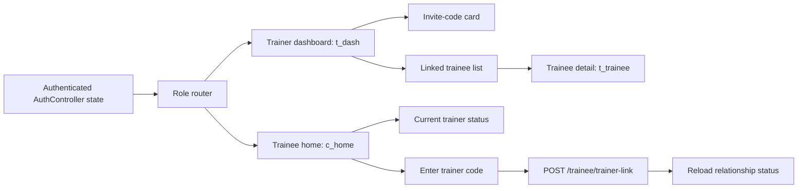

# Post-onboarding Relationship Management

## Overview

Build the post-onboarding relationship management layer for LiftMate: after login, trainers can see and manage their trainee relationship surface, trainees can see their trainer relationship status, and both roles land on product-facing screens instead of the temporary authenticated panel. This plan intentionally complements `context/changes/dostosowanie/plan.md`; it does not rebuild auth onboarding, display-name registration, or the initial invite-code pairing flow.

The implementation uses `apps/mobile/design/LiftMate.dc.html` as the visual source for the role-specific screens:

- `t_dash`: trainer dashboard with trainee list and invite action.
- `t_trainee`: trainee detail entry point from the trainer dashboard.
- `c_home`: trainee home/status screen.
- profile/nav affordances from the same design, limited to relationship status and logout for this slice.

## Current State Analysis

The active `dostosowanie` plan adds the core relationship foundation: `DisplayName`, `TrainerUserId`, `TrainerInviteCode`, `POST /trainer/invite-code`, `POST /trainee/trainer-link`, mobile auth contract updates, and onboarding pair screens. Its Phase 5 removes the old global registration gate: `/auth/register` accepts only `email`, `password`, `role`, and `displayName`, and the only user-facing code in onboarding is the trainer invite code. Automated Phase 5 checks are complete; remaining `dostosowanie` work, if any, is manual design verification rather than a blocking auth-contract gap.

The current mobile app still routes through `AuthScreen` from `apps/mobile/lib/main.dart`. Existing post-auth behavior is diagnostic or temporary, while the design file already defines product-facing role destinations: trainer dashboard, trainee detail, and trainee home. Shared-session endpoints already enforce `trainee.TrainerUserId == trainerUserId` when creating a session, so relationship data is now security-relevant and should have an explicit read surface instead of being inferred only from `/auth/me`.

## Desired End State

After authentication, trainers land on a dashboard based on `t_dash`: their invite code is available after onboarding, an empty-state CTA helps them invite a first trainee, and linked trainees appear in a list. Selecting a trainee opens a relationship detail screen based on `t_trainee`, with identity/status information and future placeholders for training data.

After authentication, trainees land on a home/status screen based on `c_home`: if linked, they see their trainer relationship; if unlinked, they see a clear prompt to enter a trainer code. A trainee can claim a new trainer code even if already linked; the MVP behavior is overwrite/re-pair, so the latest valid code becomes authoritative. Re-pairing also cancels any active shared session for that trainee so a previous trainer does not keep access through session participant IDs.

Backend exposes relationship-specific read endpoints rather than expanding `/auth/me` into a relationship dashboard contract. The plan adds only the minimal mutation needed by the chosen lifecycle decision: trainee re-pairing via the existing claim-code flow overwrites `TrainerUserId`.

## Decisions

| Area | Decision | Rationale |
| --- | --- | --- |
| Relationship lifecycle | Re-pairing overwrites the trainee's current trainer | User chose the simplest correction path for mistaken or changed trainer relationships. |
| Trainer dashboard | List trainees, show invite-code card, support empty state | This matches `t_dash` and gives the trainer a permanent relationship management entry point. |
| Trainee home | `c_home` with linked/unlinked relationship status | This matches the design and prepares the future training home without implementing workout slices. |
| API shape | Dedicated read-only relationship endpoints plus existing claim-code mutation | Keeps auth responses small and gives UI screens stable relationship contracts. |
| Empty state | Trainer sees invite-code card and CTA when no trainees exist | The first useful action is inviting a trainee, not showing zeroed dashboard stats. |
| Testing | API contract tests, mobile client tests, and widget tests for both roles | Covers the role-specific navigation and relationship contracts without adding full E2E. |

## Scope

In scope:

- Add backend relationship read contracts for trainer trainee-list, trainee current-trainer status, and trainer invite-code retrieval/generation.
- Change trainee code claiming so a valid code overwrites an existing trainer link instead of returning conflict.
- Cancel active shared sessions for the trainee during re-pair and prevent old trainers from retaining active-session access through stored participant IDs.
- Keep the one-trainer-per-trainee invariant by storing only one `TrainerUserId`.
- Update backend tests for trainer list, trainee status, invite-code read, and re-pair overwrite behavior.
- Add mobile relationship models and API client/controller methods.
- Replace the temporary authenticated panel with role-specific post-auth screens.
- Implement the trainer dashboard from the design at the relationship-management level: greeting, invite-code card, empty state, linked trainee list, and trainee detail entry.
- Implement the trainee home/status screen from the design at the relationship-management level: linked trainer status, unlinked prompt, and CTA to enter/claim a trainer code.
- Preserve logout from the authenticated area.
- Add widget tests for trainer dashboard, trainer empty state, trainee linked state, trainee unlinked state, re-pair flow, and logout.
- Preserve Phase 5's open trainer signup posture: relationship endpoints rely on the existing `TrainerOnly` role claim, where trainer role is self-selected during signup.

Out of scope:

- Rebuilding auth onboarding from `dostosowanie`.
- Reintroducing a global registration code, hidden trainer approval code, or trainer verification gate.
- Trainer exercise sets, set assignment, workout history, progress charts, and live workout UI.
- Invite-code expiration, revocation, multi-code management, audit trail, or admin recovery.
- Preventing re-pair when training data already exists; the chosen MVP behavior is overwrite.
- In-app sharing delivery for invite codes.
- Full typography asset bundling unless `dostosowanie` already added it.
- Full E2E tests across two real accounts.

## Architecture / Approach

This is a vertical relationship-management slice layered on top of the auth/pairing contract. The backend keeps `ApplicationUser.TrainerUserId` as the source of truth, adds relationship-specific response DTOs, and exposes small authorized endpoints. Re-pairing updates that source of truth and marks any active shared session that still names the old trainer as `cancelled`. Trainer relationship endpoints use the existing role boundary; they must not add a new approval or registration gate in this change. Mobile adds a relationship client/controller next to auth and renders post-auth role destinations with local screen state. The design file is the visual contract, but workout/progress data shown in the prototype is reduced to empty or placeholder states until later roadmap slices provide real data.

## Phase 1: Backend Relationship Read Surface

### Goal

Expose the relationship state needed by post-auth screens without bloating `/auth/me` or reintroducing dashboard data through auth contracts.

### Changes Required

#### `apps/api/LiftMate.Api/Auth/AuthContracts.cs`

**Intent:** Add relationship response contracts for the new post-auth screens.

**Contract:** Add DTOs for:

- `TrainerTraineeResponse(Id, Email, DisplayName)`
- `TrainerRelationshipSummaryResponse(InviteCode, IReadOnlyList<TrainerTraineeResponse> Trainees)`
- `TraineeTrainerResponse(Id, Email, DisplayName)`
- `TraineeRelationshipSummaryResponse(TraineeTrainerResponse? Trainer)`

Keep `UserResponse` limited to identity basics and `TrainerUserId`.

#### `apps/api/LiftMate.Api/Auth/PairingEndpoints.cs`

**Intent:** Extend pairing endpoints from onboarding-only mutation to post-onboarding read surface.

**Contract:** Add:

- `GET /trainer/relationship` requiring `TrainerOnly`, returning the trainer's invite code and linked trainees sorted by display name or email.
- `GET /trainee/relationship` requiring `TraineeOnly`, returning the linked trainer or `null`.

`GET /trainer/relationship` may reuse the same get-or-create code path as `POST /trainer/invite-code`, so the dashboard always has a code to show.

#### `apps/api/LiftMate.Api/Auth/PairingEndpoints.cs`

**Intent:** Support the chosen re-pair lifecycle.

**Contract:** `POST /trainee/trainer-link` no longer rejects an already linked trainee. A valid code overwrites `TrainerUserId` with the trainer behind the code, updates `LastUsedAt`, marks any active shared session where this trainee is a participant as `cancelled`, and returns the updated `UserResponse`. It still rejects invalid code, non-trainee tokens, trainer-owned misuse, and self-pairing. Invalid claim attempts must not cancel sessions or change the existing trainer link.

#### `apps/api/LiftMate.Api/SharedSessions/SharedSessionEndpoints.cs`

**Intent:** Prevent a previous trainer from retaining active-session access after the trainee re-pairs.

**Contract:** Shared-session access for trainer actions must require both stored session participation and the current relationship: the trainer user must still equal the trainee's current `TrainerUserId`. Trainee access remains based on the trainee's own participant ID so a trainee can still see their cancelled session state if needed. New trainer session creation continues to use the current relationship check.

#### `apps/api/LiftMate.Api.Tests/Auth/PairingEndpointTests.cs`

**Intent:** Lock relationship read and re-pair behavior.

**Contract:** Tests cover:

- Trainer relationship summary returns invite code and an empty trainee list for a new trainer.
- Trainer relationship summary returns linked trainees and does not include trainees linked to other trainers.
- Trainee relationship summary returns `trainer: null` before linking.
- Trainee relationship summary returns trainer identity after linking.
- Claiming a second valid trainer code overwrites the previous `TrainerUserId`.
- Claiming a second valid trainer code marks the trainee's active shared session with the old trainer as `cancelled`.
- Invalid code still fails without changing the existing trainer link.
- Invalid code still fails without cancelling active sessions.
- Trainer-only and trainee-only policies protect the new endpoints.

#### `apps/api/LiftMate.Api.Tests/SharedSessions/SharedSessionEndpointTests.cs`

**Intent:** Lock access-control behavior after re-pair.

**Contract:** Tests prove an old trainer cannot read, update, complete, or cancel a session after the trainee re-pairs to another trainer. Tests also prove valid re-pair marks the previous active session as `cancelled`, and invalid re-pair attempts do not cancel active sessions or remove the old trainer's access.

### Success Criteria

#### Automated Verification

- `dotnet restore LiftMate.slnx` succeeds from `apps/api`.
- `dotnet build LiftMate.slnx --no-restore` succeeds from `apps/api`.
- `dotnet test LiftMate.slnx --no-build` succeeds from `apps/api`.

#### Manual Verification

- A trainer can call `GET /trainer/relationship` and receive an invite code plus only their linked trainees.
- A trainee can call `GET /trainee/relationship` before and after pairing and see `null` then trainer identity.
- A trainee linked to trainer A can submit trainer B's valid code and `/auth/me` then shows trainer B.
- After re-pair, trainer A can no longer access the previous shared session for that trainee, and that session is `cancelled`.

---

## Phase 2: Mobile Relationship Contract

### Goal

Give Flutter typed access to relationship summaries and re-pairing without coupling post-auth screens directly to low-level auth requests.

### Changes Required

#### `apps/mobile/lib/relationships/relationship_models.dart` (new)

**Intent:** Represent the backend relationship summaries in mobile state.

**Contract:** Add models matching the backend response names conceptually:

- `TrainerRelationshipSummary` with `inviteCode` and `trainees`.
- `TrainerTraineeSummary` with `id`, `email`, and `displayName`.
- `TraineeRelationshipSummary` with nullable `trainer`.
- `TraineeTrainerSummary` with `id`, `email`, and `displayName`.

JSON parsing should be strict for required fields and tolerate `trainer: null`.

#### `apps/mobile/lib/relationships/relationship_api_client.dart` (new)

**Intent:** Keep relationship HTTP calls separate from auth token/session mechanics.

**Contract:** Add methods:

- `getTrainerRelationship(accessToken)`
- `getTraineeRelationship(accessToken)`

Do not duplicate `POST /trainee/trainer-link` here. `dostosowanie` already adds claim-code support to `AuthApiClient` and `AuthController`; the relationship layer should reuse that mutation.

#### `apps/mobile/lib/relationships/relationship_controller.dart` (new)

**Intent:** Provide screen-friendly loading/error/data state for post-auth relationship screens.

**Contract:** Controller accepts `RelationshipApiClient`, `AuthController`, and exposes:

- `loadForUser(AuthUser user)`
- `claimTrainerCode(String code)`
- `reload()`

`claimTrainerCode` calls the existing `AuthController.claimTrainerInviteCode`, which owns token access, code normalization, `POST /trainee/trainer-link`, and authenticated-user state updates. After a successful claim, the relationship controller reloads `GET /trainee/relationship`.

#### `apps/mobile/test/relationship_api_client_test.dart` (new)

**Intent:** Lock mobile/backend relationship contracts.

**Contract:** Tests cover trainer summary parsing, trainee summary with null trainer, trainee summary with trainer, 401/403/error mapping, and invalid JSON handling.

#### `apps/mobile/test/relationship_controller_test.dart` (new or existing auth-controller test extension)

**Intent:** Lock role-based loading and re-pair state transitions.

**Contract:** Tests cover trainer load, trainee linked load, trainee unlinked load, claim success through `AuthController.claimTrainerInviteCode`, claim failure preserving current relationship state, and missing-token error behavior surfaced by the auth controller.

### Success Criteria

#### Automated Verification

- `flutter test test/relationship_api_client_test.dart` succeeds from `apps/mobile`.
- `flutter test test/relationship_controller_test.dart` succeeds from `apps/mobile`.
- `flutter test` succeeds from `apps/mobile`.
- `flutter analyze` succeeds from `apps/mobile`.

#### Manual Verification

- Mobile calls `GET /trainer/relationship` with a trainer token after login.
- Mobile calls `GET /trainee/relationship` with a trainee token after login.
- Mobile re-pairing uses `AuthController.claimTrainerInviteCode`; relationship state reloads after success.

---

## Phase 3: Post-auth Role Screens

### Goal

Replace the temporary authenticated surface with relationship-aware role destinations based on the design file.

### Changes Required

#### `apps/mobile/lib/main.dart`

**Intent:** Wire relationship dependencies at app composition.

**Contract:** Instantiate `RelationshipApiClient` with the same API base URL as auth/shared sessions and pass it to the authenticated app surface. Preserve the app theme introduced by `dostosowanie`.

#### `apps/mobile/lib/auth/auth_screen.dart` or new authenticated shell under `apps/mobile/lib/relationships/`

**Intent:** Stop rendering a temporary authenticated panel after login.

**Contract:** When `AuthControllerState.authenticated` is reached:

- Trainer users render trainer relationship dashboard.
- Trainee users render trainee relationship home.
- Logout remains available from the authenticated area.

If `dostosowanie` splits auth/onboarding into smaller widgets, follow that structure instead of expanding `auth_screen.dart`.

#### `apps/mobile/lib/relationships/trainer_dashboard_screen.dart` (new)

**Intent:** Implement the relationship-level subset of design screen `t_dash`.

**Contract:** Screen shows:

- Greeting using `AuthUser.displayName`.
- Invite-code card using the trainer relationship summary.
- Empty state with CTA `Zaproś podopiecznego` when no trainees exist.
- Trainee list when linked trainees exist.
- Tapping a trainee opens the trainee detail screen.
- Bottom nav/profile affordances only where they have a working destination in this slice.

Dashboard counters from the design should either be omitted or rendered as relationship-backed values only. Do not invent workout counts.

#### `apps/mobile/lib/relationships/trainer_trainee_detail_screen.dart` (new)

**Intent:** Implement the relationship-level subset of design screen `t_trainee`.

**Contract:** Screen shows trainee display name, email, linked status, and future placeholders for assigned set/progress if needed. It must not claim workout, set, or progress data exists until later slices implement it.

#### `apps/mobile/lib/relationships/trainee_home_screen.dart` (new)

**Intent:** Implement the relationship-level subset of design screen `c_home`.

**Contract:** Screen shows:

- Greeting using `AuthUser.displayName`.
- If linked: trainer identity and a disabled/placeholder workout area.
- If unlinked: clear prompt to enter a trainer code.
- Re-pair entry point that accepts a new trainer code and submits through the relationship controller.
- Errors without leaking access tokens or invite-code secrets beyond the user's own input.

#### `apps/mobile/test/post_auth_relationship_screen_test.dart` (new)

**Intent:** Protect role-specific post-auth behavior.

**Contract:** Widget tests cover:

- Trainer with no trainees sees invite-code empty state and CTA.
- Trainer with trainees sees list entries and can open detail.
- Trainee linked to trainer sees trainer identity.
- Trainee unlinked sees enter-code prompt.
- Trainee can submit a new code and the screen reloads relationship state.
- Failed claim shows a readable error and preserves the previous state.
- Logout returns to unauthenticated onboarding.

### Success Criteria

#### Automated Verification

- `flutter test test/post_auth_relationship_screen_test.dart` succeeds from `apps/mobile`.
- `flutter test` succeeds from `apps/mobile`.
- `flutter analyze` succeeds from `apps/mobile`.

#### Manual Verification

- Trainer login lands on a dark `t_dash`-style screen, not the old diagnostic/temporary panel.
- Trainer with no trainees sees the invite-code card and `Zaproś podopiecznego` CTA.
- Trainer with at least one trainee sees that trainee in the list and can open detail.
- Trainee login with a trainer lands on a `c_home`-style screen showing trainer identity.
- Trainee login without a trainer sees a clear code-entry prompt.
- Trainee can enter a second trainer's valid code and the displayed trainer changes.
- Text and controls fit on a phone-sized viewport without overlap.

---

## Testing Strategy

### Backend Tests

- Relationship summary authorization for trainer and trainee endpoints.
- Trainer summary returns only trainees linked to the current trainer.
- Trainee summary returns null or current trainer identity.
- Re-pair overwrite changes `TrainerUserId` to the new trainer.
- Invalid re-pair does not mutate the existing relationship.

### Mobile Contract Tests

- Relationship JSON parsing for all summary states.
- Claim-code normalization.
- HTTP status mapping for unauthorized, forbidden, not found, conflict, offline, and malformed JSON.
- Controller state transitions for load, reload, claim success, and claim failure.

### Widget Tests

- Trainer empty state and invite-code card.
- Trainer list and trainee detail navigation.
- Trainee linked state.
- Trainee unlinked state and code-entry flow.
- Logout from the authenticated shell.

### Manual Testing Steps

1. Rebase on `context/changes/dostosowanie` after Phase 5 so registration has no global `invitationCode`, auth onboarding uses only the trainer invite code, and `AuthController.claimTrainerInviteCode` is available.
2. Register or log in as a trainer and confirm the post-auth destination is the trainer dashboard.
3. Confirm the trainer dashboard shows a persistent invite code after leaving onboarding.
4. Register or log in as a trainee with no trainer and confirm the unlinked prompt appears.
5. Pair the trainee to trainer A and confirm the trainee home shows trainer A.
6. Pair the same trainee to trainer B and confirm trainer B replaces trainer A.
7. Log in as trainer A and trainer B and confirm only trainer B lists the trainee after re-pairing.
8. Confirm logout returns to onboarding.

## Performance Considerations

Relationship summaries are small and can be loaded on post-auth screen entry. Trainer trainee-list queries should use the existing `TrainerUserId` index. Re-pair needs one bounded active-session lookup/update for the trainee so old trainer access is cancelled at the same time as the relationship change. Do not add realtime subscriptions for relationship changes in this slice; manual reload after code claim is enough for MVP. Avoid rendering design placeholder stats that would require fake workout data or extra backend calls.

## Migration Notes

This plan assumes the `dostosowanie` migration has already added `DisplayName`, `TrainerUserId`, and `TrainerInviteCodes`, and that Phase 5 has removed the global registration invite-code gate. No new database table is expected. Re-pair overwrite and active-session cancellation change endpoint behavior only; they do not require schema changes. If `dostosowanie` has not landed yet, implement this plan after rebasing on that migration and contract.

## Rollback Notes

Backend relationship read endpoints are additive. Rolling back mobile post-auth screens can return users to the temporary authenticated panel as long as auth and pairing contracts from `dostosowanie` remain. Reverting re-pair overwrite to conflict behavior may strand users who already changed trainer links, so rollback should be accompanied by a product decision on which trainer link remains authoritative. If active-session cancellation is rolled back, old-trainer access must be re-audited before deployment. Do not roll back Phase 5's registration-gate removal from this change; any trainer verification or approval flow belongs in a separate plan.

## References

- Roadmap item: `context/foundation/roadmap.md` S-01 `trainer-trainee-pairing`
- Upstream dependency: `context/changes/dostosowanie/plan.md`
- Design prototype: `apps/mobile/design/LiftMate.dc.html`
- Design screens: `t_dash`, `t_trainee`, `c_home`, `pair`
- Backend pairing endpoints: `apps/api/LiftMate.Api/Auth/PairingEndpoints.cs`
- Backend shared-session endpoints: `apps/api/LiftMate.Api/SharedSessions/SharedSessionEndpoints.cs`
- Backend auth contracts: `apps/api/LiftMate.Api/Auth/AuthContracts.cs`
- User relationship model: `apps/api/LiftMate.Api/Auth/ApplicationUser.cs`
- Mobile auth client: `apps/mobile/lib/auth/auth_api_client.dart`
- Mobile auth controller: `apps/mobile/lib/auth/auth_controller.dart`
- Mobile app entry point: `apps/mobile/lib/main.dart`

## Progress

> Convention: `- [ ]` pending, `- [x]` done. Append ` - <commit sha>` when a step lands. Do not rename step titles. See `references/progress-format.md`.

### Phase 1: Backend Relationship Read Surface

#### Automated

- [x] 1.1 `dotnet restore LiftMate.slnx` succeeds from `apps/api` — 866d625
- [x] 1.2 `dotnet build LiftMate.slnx --no-restore` succeeds from `apps/api` — 866d625
- [x] 1.3 `dotnet test LiftMate.slnx --no-build` succeeds from `apps/api` — 866d625

#### Manual

- [ ] 1.4 A trainer can call `GET /trainer/relationship` and receive an invite code plus only their linked trainees.
- [ ] 1.5 A trainee can call `GET /trainee/relationship` before and after pairing and see `null` then trainer identity.
- [ ] 1.6 A trainee linked to trainer A can submit trainer B's valid code and `/auth/me` then shows trainer B.
- [ ] 1.7 After re-pair, trainer A can no longer access the previous shared session for that trainee, and that session is `cancelled`.

### Phase 2: Mobile Relationship Contract

#### Automated

- [x] 2.1 `flutter test test/relationship_api_client_test.dart` succeeds from `apps/mobile` — 22283aa
- [x] 2.2 `flutter test test/relationship_controller_test.dart` succeeds from `apps/mobile` — 22283aa
- [x] 2.3 `flutter test` succeeds from `apps/mobile` — 22283aa
- [x] 2.4 `flutter analyze` succeeds from `apps/mobile` — 22283aa

#### Manual

- [ ] 2.5 Mobile calls `GET /trainer/relationship` with a trainer token after login.
- [ ] 2.6 Mobile calls `GET /trainee/relationship` with a trainee token after login.
- [ ] 2.7 Mobile re-pairing uses `AuthController.claimTrainerInviteCode`; relationship state reloads after success.

### Phase 3: Post-auth Role Screens

#### Automated

- [x] 3.1 `flutter test test/post_auth_relationship_screen_test.dart` succeeds from `apps/mobile`.
- [x] 3.2 `flutter test` succeeds from `apps/mobile`.
- [x] 3.3 `flutter analyze` succeeds from `apps/mobile`.

#### Manual

- [ ] 3.4 Trainer login lands on a dark `t_dash`-style screen, not the old diagnostic/temporary panel.
- [ ] 3.5 Trainer with no trainees sees the invite-code card and `Zaproś podopiecznego` CTA.
- [ ] 3.6 Trainer with at least one trainee sees that trainee in the list and can open detail.
- [ ] 3.7 Trainee login with a trainer lands on a `c_home`-style screen showing trainer identity.
- [ ] 3.8 Trainee login without a trainer sees a clear code-entry prompt.
- [ ] 3.9 Trainee can enter a second trainer's valid code and the displayed trainer changes.
- [ ] 3.10 Text and controls fit on a phone-sized viewport without overlap.
