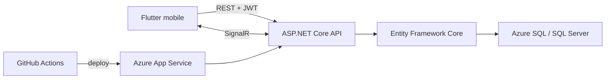

# README certyfikacyjne LiftMate Implementation Plan

> **For agentic workers:** REQUIRED SUB-SKILL: Use superpowers:subagent-driven-development (recommended) or superpowers:executing-plans to implement this plan task-by-task. Steps use checkbox (`- [ ]`) syntax for tracking.

**Goal:** Zbudować product-first README LiftMate z czterema ekranami, pełną instrukcją techniczną i działającymi linkami do prezentacji oraz Android Release `v1.0.0`.

**Architecture:** README będzie pojedynczą stroną wejściową prowadzącą od wartości produktu do szczegółów uruchomienia. Obrazy zostaną wyrenderowane z istniejącej prezentacji HTML, a APK powstanie ze zweryfikowanego kodu i trafi wyłącznie do GitHub Release, nie do historii Git.

**Tech Stack:** Markdown, Flutter 3.44 / Dart 3.12, ASP.NET Core 10, EF Core 10, SignalR, Azure SQL, GitHub Releases, in-app Browser.

---

## Struktura plików

- Modify: `README.md` — publiczna strona wejściowa projektu.
- Create: `docs/assets/readme/trainer-dashboard.png` — Pulpit trenera.
- Create: `docs/assets/readme/trainer-guidance.png` — szczegóły podopiecznego z podpowiedziami.
- Create: `docs/assets/readme/live-session.png` — sesja prowadzona na żywo.
- Create: `docs/assets/readme/exercise-progress.png` — progres ćwiczenia.
- Reference only: `apps/mobile/design/LiftMate - prezentacja.html` — źródło obrazów.
- Build only: `apps/mobile/build/app/outputs/flutter-apk/app-release.apk` — źródło zasobu Release.
- Temporary outside Git: `LiftMate-v1.0.0-android.apk` — nazwa publikowanego zasobu.

### Task 1: Weryfikacja źródeł i przygotowanie galerii

**Files:**
- Create: `docs/assets/readme/trainer-dashboard.png`
- Create: `docs/assets/readme/trainer-guidance.png`
- Create: `docs/assets/readme/live-session.png`
- Create: `docs/assets/readme/exercise-progress.png`
- Inspect: `apps/mobile/design/LiftMate - prezentacja.html`

- [ ] **Step 1: Potwierdź czysty zakres roboczy i źródła**

Run:

```powershell
git status --short
git branch --show-current
Get-Item 'apps/mobile/design/LiftMate - prezentacja.html'
Get-Item 'apps/mobile/design/mapa-implementacji.md'
Get-Item 'apps/mobile/design/prezentacja-funkcji.md'
```

Expected: gałąź `deploy-2026-05-26`; brak niepowiązanych zmian; wszystkie trzy pliki istnieją.

- [ ] **Step 2: Otwórz prezentację lokalnie i potwierdź cztery stany**

Użyj `browser:control-in-app-browser`, otwórz lokalny plik prezentacji i kolejno wybierz przyciski widoczne w indeksie:

```text
Pulpit
Podopieczny
Sesja na żywo
Progres ćwiczenia
```

Dla każdego stanu sprawdź, że widoczny ekran telefonu odpowiada nazwie w panelu opisu. Przy `Podopieczny` potwierdź widoczność sekcji podpowiedzi; przy `Sesja na żywo` wybierz wariant trenera.

- [ ] **Step 3: Zapisz cztery obrazy telefonu**

Dla każdego stanu odczytaj prostokąt `.lm-phone` i wykonaj screenshot z tym `clip`. Zapisz pliki dokładnie jako:

```text
docs/assets/readme/trainer-dashboard.png
docs/assets/readme/trainer-guidance.png
docs/assets/readme/live-session.png
docs/assets/readme/exercise-progress.png
```

Obraz ma obejmować ramkę telefonu i zawartość ekranu, bez bocznego indeksu oraz panelu opisowego.

- [ ] **Step 4: Zweryfikuj obrazy wizualnie i technicznie**

Otwórz każdy plik przez narzędzie podglądu obrazu i sprawdź czytelność, brak obcięcia telefonu i zgodność ekranu z nazwą pliku.

Run:

```powershell
Get-ChildItem docs/assets/readme/*.png | Select-Object Name,Length
```

Expected: dokładnie cztery niepuste pliki PNG.

- [ ] **Step 5: Zatwierdź zasoby galerii**

Run:

```powershell
git add docs/assets/readme/trainer-dashboard.png docs/assets/readme/trainer-guidance.png docs/assets/readme/live-session.png docs/assets/readme/exercise-progress.png
git commit -m "docs: dodaj galerię LiftMate"
```

Expected: commit obejmuje dokładnie cztery obrazy i nie zawiera stopki `Co-authored-by`.

### Task 2: Napisanie product-first README

**Files:**
- Modify: `README.md`
- Reference: `apps/mobile/design/prezentacja-funkcji.md`
- Reference: `apps/mobile/design/mapa-implementacji.md`
- Reference: `context/foundation/prd.md`
- Reference: `context/foundation/prd-expansion.md`
- Reference: `context/foundation/roadmap.md`
- Reference: `context/foundation/infrastructure.md`

- [ ] **Step 1: Zastąp minimalny README nagłówkiem produktu i CTA**

Początek dokumentu ma zawierać następujący przekaz i linki:

```markdown
# LiftMate

**Mobilna aplikacja treningowa, która łączy trenera z podopiecznym — od przygotowania planu, przez wspólną sesję na żywo, aż po feedback i mierzalny progres.**

[Zobacz interaktywną prezentację](https://jdemb.github.io/liftmate-demo) · [Pobierz aplikację na Androida](https://github.com/jdemb/PrototypApka/releases/download/v1.0.0/LiftMate-v1.0.0-android.apk)

> Prezentacja pozwala przejść przez wszystkie ekrany bez instalowania aplikacji. APK jest wersją demonstracyjną instalowaną ręcznie poza Google Play.
```

Nie dodawaj badge'y sugerujących CI, publikację w sklepie ani obsługę iOS, których repozytorium nie potwierdza.

- [ ] **Step 2: Dodaj galerię 2×2**

Użyj tabeli HTML, aby obrazy pozostały czytelne na GitHubie:

```html
<table>
  <tr>
    <td align="center"><br><strong>Pulpit trenera</strong></td>
    <td align="center"><br><strong>Podopieczny i podpowiedzi</strong></td>
  </tr>
  <tr>
    <td align="center"><br><strong>Sesja na żywo</strong></td>
    <td align="center"><br><strong>Progres ćwiczenia</strong></td>
  </tr>
</table>
```

- [ ] **Step 3: Dodaj opis produktu, użytkowników i funkcji**

Utwórz sekcje `## O projekcie`, `## Dla kogo?` i `## Główne funkcje`. Tekst ma objąć:

```text
LiftMate ogranicza liczbę decyzji podejmowanych na siłowni: trener przygotowuje i przypisuje plan, a podopieczny wykonuje go z aktualnymi wartościami i zachowuje ciągłość progresu.

Trener — prowadzi wielu podopiecznych, zarządza planami, uruchamia wspólne sesje i analizuje historię.
Podopieczny — wykonuje trening prowadzony albo samodzielny, przekazuje feedback i obserwuje progres.
```

Lista funkcji ma zawierać dziewięć potwierdzonych pozycji:

```text
relacja jeden trener–wielu podopiecznych
tworzenie, edycja, usuwanie i wielokrotne przypisywanie zestawów
wspólna sesja aktualizowana bez ręcznego odświeżania
samodzielny trening podopiecznego
zapis wyników jako punkt startowy kolejnego treningu
historia sesji i progres ćwiczeń
feedback po treningu
aktualna i najlepsza seria tygodniowa
podpowiedzi o stagnacji i obniżonym samopoczuciu
```

Na końcu sekcji dodaj linki do `apps/mobile/design/prezentacja-funkcji.md` oraz `apps/mobile/design/mapa-implementacji.md`.

- [ ] **Step 4: Dodaj architekturę i strukturę repozytorium**

Użyj diagramu:



Pod diagramem opisz odpowiedzialności Fluttera, ASP.NET Core, EF Core/SQL oraz Azure. Dodaj drzewo:

```text
apps/mobile/      aplikacja Flutter i testy mobilne
apps/api/         API ASP.NET Core, migracje i testy integracyjne
context/          PRD, roadmapa, infrastruktura i historia zmian
docs/assets/      zasoby dokumentacji
```

- [ ] **Step 5: Dodaj wymagania i konfigurację**

W sekcji `## Wymagania środowiskowe` podaj:

```text
Flutter 3.44.0 / Dart 3.12.0 — wersje użyte do weryfikacji
.NET SDK 10.0 — projekt targetuje net10.0
JDK 17 i Android SDK — wymagane przez konfigurację Androida
Android Emulator lub fizyczne urządzenie Android
SQL Server LocalDB na Windows albo dostępna instancja SQL Server
dotnet-ef 10.0.8 — do migracji lokalnej bazy
```

W sekcji `## Konfiguracja` pokaż bezpieczny przykład PowerShell uruchamiany w `apps/api`:

```powershell
$env:ConnectionStrings__DefaultConnection="Server=(localdb)\mssqllocaldb;Database=LiftMateDev;Trusted_Connection=True;TrustServerCertificate=True"
$env:Jwt__SigningKey="lokalny-klucz-o-dlugosci-co-najmniej-32-znakow"
$env:Auth__RegistrationInviteCode="lokalny-kod-beta"
```

Wyjaśnij, że wartości są przykładowe, nie należy ich commitować, a produkcja używa konfiguracji Azure. Opisz `apps/mobile/config/app_config.json` i opcjonalne `--dart-define=API_BASE_URL=...`.

- [ ] **Step 6: Dodaj dokładne instrukcje uruchomienia**

API, z katalogu `apps/api`:

```powershell
dotnet restore LiftMate.slnx
dotnet tool install --global dotnet-ef --version 10.0.8
dotnet ef database update --project LiftMate.Api\LiftMate.Api.csproj --startup-project LiftMate.Api\LiftMate.Api.csproj
dotnet run --project LiftMate.Api\LiftMate.Api.csproj
```

Aplikacja, z katalogu `apps/mobile`:

```powershell
flutter pub get
flutter devices
flutter run
```

Dla Android Emulatora i lokalnego API pokaż:

```powershell
flutter run --dart-define=API_BASE_URL=http://10.0.2.2:5257
```

Wyjaśnij, że domyślny plik konfiguracyjny wskazuje publiczne środowisko demonstracyjne, a `10.0.2.2` jest adresem hosta z perspektywy Android Emulatora.

- [ ] **Step 7: Dodaj komendy testów i dokumentację**

Mobile, z `apps/mobile`:

```powershell
flutter analyze
flutter test
```

API, z `apps/api`:

```powershell
dotnet restore LiftMate.slnx
dotnet build LiftMate.slnx --no-restore
dotnet test LiftMate.slnx --no-build --verbosity minimal
dotnet list LiftMate.slnx package --vulnerable --include-transitive
```

Dodaj względne linki do:

```text
context/foundation/prd.md
context/foundation/prd-expansion.md
context/foundation/roadmap.md
context/foundation/infrastructure.md
context/foundation/tech-stack.md
context/foundation/tech-stack-api.md
apps/mobile/design/prezentacja-funkcji.md
apps/mobile/design/mapa-implementacji.md
```

- [ ] **Step 8: Dodaj status platform i ograniczenia**

Użyj dokładnego komunikatu:

```markdown
## Status platform

- **Android:** główna platforma demonstracyjna; dostępny jest instalacyjny APK.
- **iOS:** kod platformowy jest obecny w projekcie Flutter, ale aplikacja nie była testowana na fizycznych urządzeniach z systemem iOS z powodu braku dostępu do wymaganego środowiska Apple.
```

Nie deklaruj, że iOS nie jest obsługiwany albo że kompilacja iOS została zweryfikowana.

- [ ] **Step 9: Zatwierdź README**

Run:

```powershell
git add README.md
git commit -m "docs: rozbuduj README LiftMate"
```

Expected: commit obejmuje tylko `README.md` i nie zawiera stopki `Co-authored-by`.

### Task 3: Weryfikacja README i repozytorium

**Files:**
- Verify: `README.md`
- Verify: `docs/assets/readme/*.png`

- [ ] **Step 1: Sprawdź wymagane sekcje i komunikaty**

Run:

```powershell
rg -n "^# LiftMate$|interaktywną prezentację|Pobierz aplikację na Androida|^## O projekcie$|^## Dla kogo\?$|^## Główne funkcje$|^## Architektura$|^## Wymagania środowiskowe$|^## Konfiguracja$|^## Uruchamianie|^## Testy$|^## Dokumentacja$|^## Status platform$|fizycznych urządzeniach z systemem iOS" README.md
```

Expected: każda wymagana fraza występuje dokładnie w odpowiedniej sekcji.

- [ ] **Step 2: Sprawdź wszystkie względne linki i obrazy**

Run:

```powershell
$doc = Get-Content -Raw README.md
$relative = [regex]::Matches($doc, '(?:src="|\]\()([^"\)#]+)') | ForEach-Object { $_.Groups[1].Value } | Where-Object { $_ -notmatch '^(https?://|#)' }
$missing = $relative | Where-Object { -not (Test-Path $_) }
$missing
```

Expected: brak wyniku.

- [ ] **Step 3: Sprawdź brak sekretów i fałszywych deklaracji**

Run:

```powershell
rg -n "AZURE_CLIENT_SECRET|AZURE_SQL_CONNECTION_STRING|Bearer [A-Za-z0-9]|nie obsługuje iOS|przetestowano na iOS|Google Play" README.md
```

Expected: jedyne dopuszczalne wystąpienie `Google Play` informuje o ręcznej instalacji spoza sklepu; pozostałe wzorce nie występują.

- [ ] **Step 4: Zweryfikuj publiczne adresy**

Sprawdź w przeglądarce:

```text
https://jdemb.github.io/liftmate-demo
https://liftmate-api-dev-jdemb.azurewebsites.net/health
```

Expected: prezentacja się renderuje; health API zwraca `200` i `{"status":"ok"}`. Jeżeli środowisko blokuje połączenie, odnotuj ograniczenie i nie zastępuj adresów innymi bez potwierdzenia.

- [ ] **Step 5: Uruchom pełną weryfikację projektu**

Run from `apps/mobile`:

```powershell
flutter analyze
flutter test --reporter compact
```

Run from `apps/api`:

```powershell
dotnet restore LiftMate.slnx
dotnet build LiftMate.slnx --no-restore
dotnet test LiftMate.slnx --no-build --verbosity minimal
dotnet list LiftMate.slnx package --vulnerable --include-transitive
```

Expected: analiza, build i testy przechodzą; audyt nie raportuje znanych podatnych pakietów.

### Task 4: Zbudowanie APK wersji certyfikacyjnej

**Files:**
- Generate: `apps/mobile/build/app/outputs/flutter-apk/app-release.apk`
- Temporary: `apps/mobile/build/app/outputs/flutter-apk/LiftMate-v1.0.0-android.apk`

- [ ] **Step 1: Zbuduj świeży release APK**

Run from `apps/mobile`:

```powershell
flutter build apk --release --dart-define=API_BASE_URL=https://liftmate-api-dev-jdemb.azurewebsites.net
```

Expected: `build/app/outputs/flutter-apk/app-release.apk` istnieje i build kończy się kodem 0.

- [ ] **Step 2: Skopiuj artefakt pod nazwę Release**

Run from `apps/mobile`:

```powershell
Copy-Item -LiteralPath 'build\app\outputs\flutter-apk\app-release.apk' -Destination 'build\app\outputs\flutter-apk\LiftMate-v1.0.0-android.apk' -Force
Get-FileHash 'build\app\outputs\flutter-apk\LiftMate-v1.0.0-android.apk' -Algorithm SHA256
```

Expected: plik istnieje, ma niezerowy rozmiar i otrzymuje 64-znakowy hash SHA-256.

- [ ] **Step 3: Potwierdź, że APK nie jest śledzony przez Git**

Run:

```powershell
git status --short
git check-ignore apps/mobile/build/app/outputs/flutter-apk/LiftMate-v1.0.0-android.apk
```

Expected: APK nie pojawia się w `git status`; `git check-ignore` zwraca ścieżkę artefaktu.

### Task 5: Publikacja GitHub Release `v1.0.0`

**Files:**
- Upload: `apps/mobile/build/app/outputs/flutter-apk/LiftMate-v1.0.0-android.apk`
- No repository file changes.

- [ ] **Step 1: Sprawdź uwierzytelnienie i brak istniejącego tagu**

Run:

```powershell
gh auth status
git tag --list v1.0.0
gh release view v1.0.0
```

Expected before first publication: `gh auth status` działa; lokalny tag i Release nie istnieją. Jeżeli uwierzytelnienie nadal zwraca 401, zatrzymaj publikację i poproś użytkownika o odświeżenie logowania `gh`; nie publikuj anonimowo ani innym kontem.

- [ ] **Step 2: Wypchnij commit README i galerii na bieżącą gałąź**

Run:

```powershell
git status --short
git push origin deploy-2026-05-26
```

Expected: czysty worktree; zdalna gałąź zawiera commit README i cztery obrazy.

- [ ] **Step 3: Utwórz Release z konkretnym targetem**

Run from repository root:

```powershell
gh release create v1.0.0 'apps/mobile/build/app/outputs/flutter-apk/LiftMate-v1.0.0-android.apk#LiftMate-v1.0.0-android.apk' --repo jdemb/PrototypApka --target deploy-2026-05-26 --title 'LiftMate MVP — wersja certyfikacyjna' --notes 'Pierwsza kompletna wersja demonstracyjna LiftMate dla Androida. Zawiera przepływy trenera i podopiecznego, plany treningowe, wspólną sesję na żywo, historię, progres, feedback i podpowiedzi. Interaktywna prezentacja bez instalacji: https://jdemb.github.io/liftmate-demo. APK należy zainstalować ręcznie poza Google Play.'
```

Expected: GitHub zwraca publiczny URL Release, a zasób ma nazwę `LiftMate-v1.0.0-android.apk`.

- [ ] **Step 4: Zweryfikuj Release i link z README**

Run:

```powershell
gh release view v1.0.0 --repo jdemb/PrototypApka --json tagName,name,url,isDraft,isPrerelease,assets
```

Expected: tag `v1.0.0`, właściwa nazwa, `isDraft=false`, `isPrerelease=false` i dokładnie jeden APK o oczekiwanej nazwie.

Otwórz w przeglądarce:

```text
https://github.com/jdemb/PrototypApka/releases/download/v1.0.0/LiftMate-v1.0.0-android.apk
```

Expected: link prowadzi do pobrania opublikowanego zasobu.

### Task 6: Końcowa kontrola zakresu

**Files:**
- Verify: `README.md`
- Verify: `docs/assets/readme/*.png`

- [ ] **Step 1: Sprawdź końcową historię i stan repozytorium**

Run:

```powershell
git status --short
git log -4 --oneline
git show --stat --oneline HEAD
```

Expected: czysty worktree; osobny commit galerii i osobny commit README; brak APK w historii.

- [ ] **Step 2: Sprawdź publiczny README na wypchniętej gałęzi**

Otwórz:

```text
https://github.com/jdemb/PrototypApka/tree/deploy-2026-05-26
```

Expected: nagłówek, CTA, galeria 2×2, Mermaid, komendy i linki renderują się bez błędów.

- [ ] **Step 3: Zgłoś granicę integracji**

W podsumowaniu podaj, że Release `v1.0.0` wskazuje `deploy-2026-05-26`, a widoczność nowego README na domyślnej stronie repozytorium wymaga osobnego scalenia tej gałęzi do `main`. Nie wykonuj tego dużego merge bez osobnej decyzji użytkownika.
